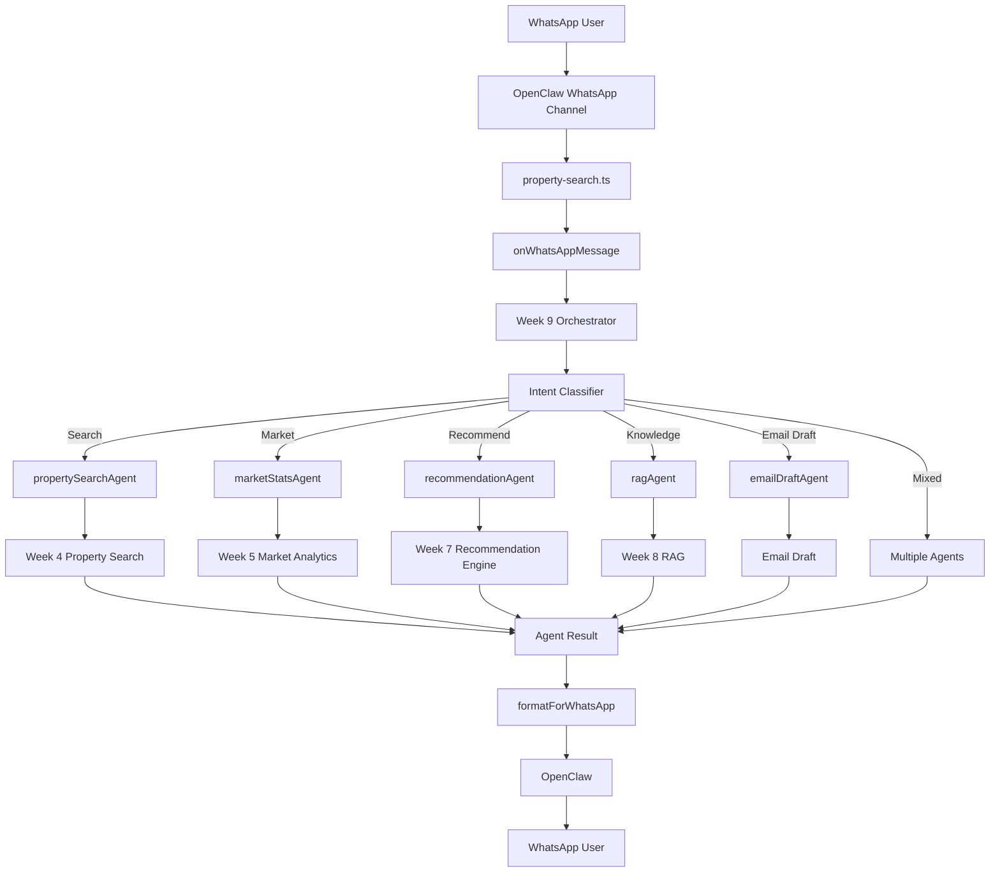
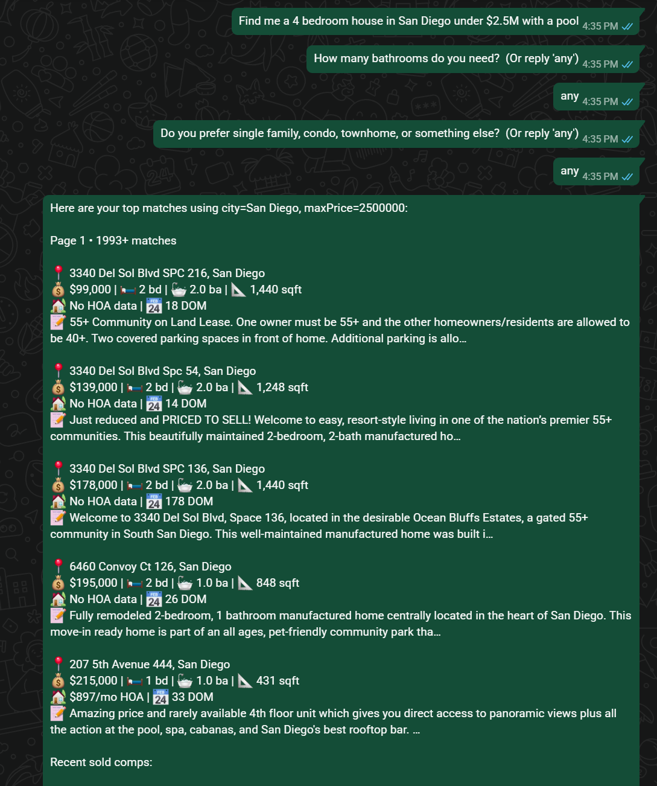
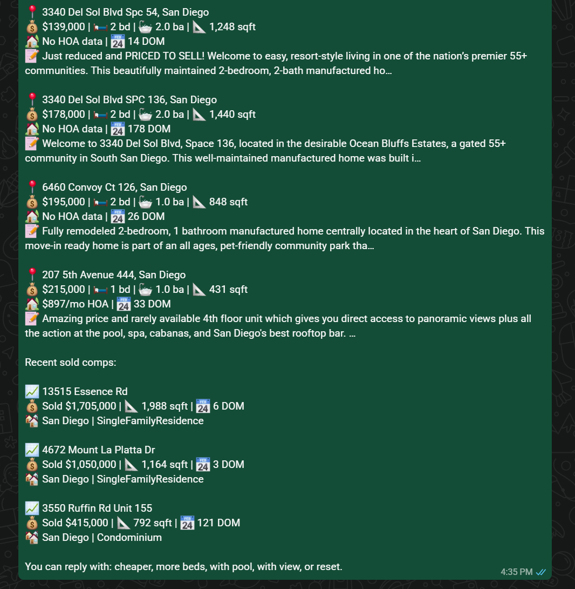
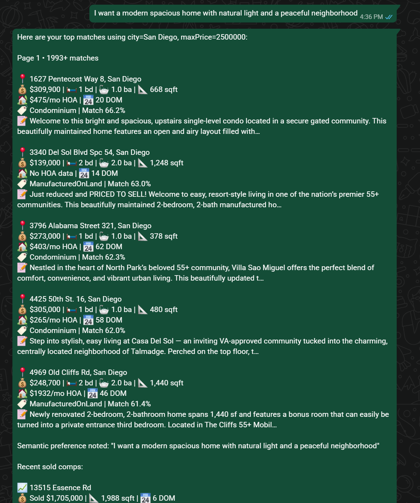
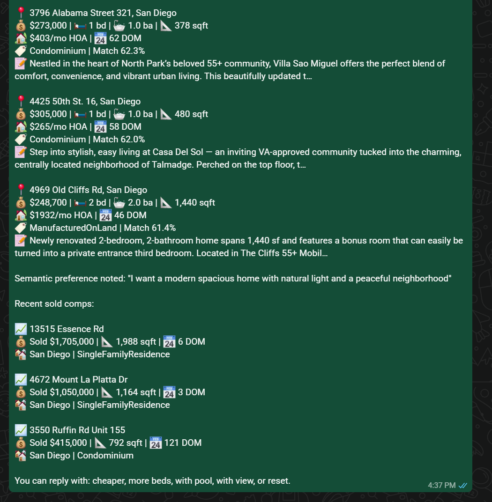
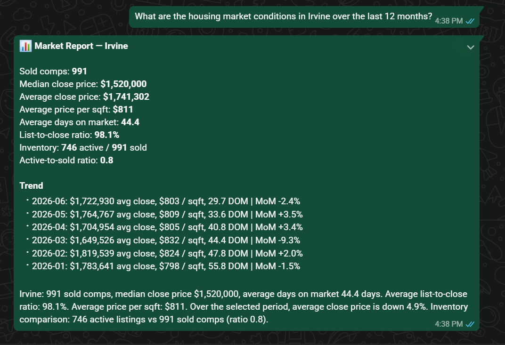
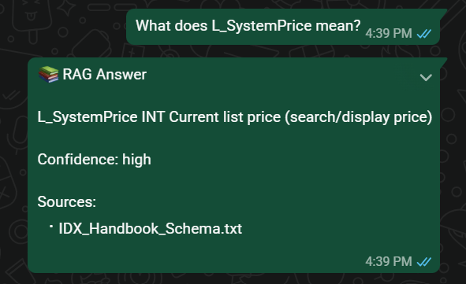
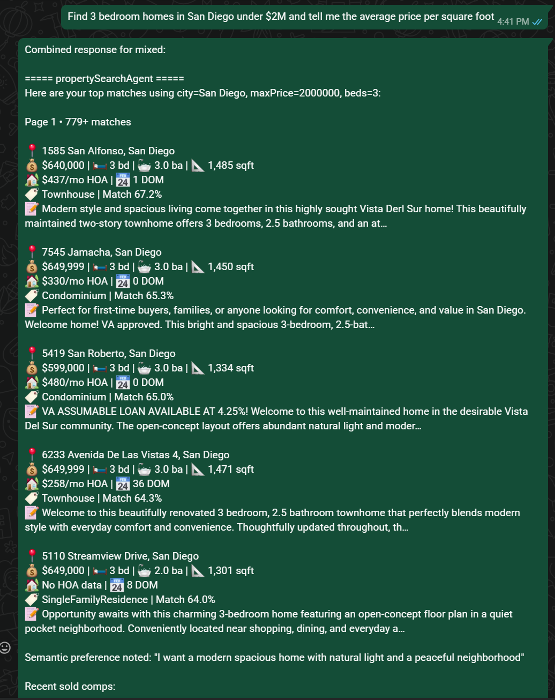
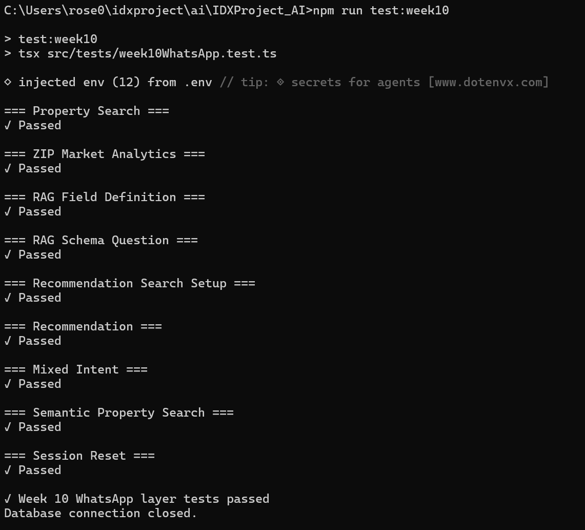

# WEEK 10 - WhatsApp Communication Layer
Week 10 connects the completed multi-agent orchestration system to the WhatsApp communication interface used by the project.

The WhatsApp layer acts as the communication boundary between the OpenClaw WhatsApp channel and the Week 9 orchestrator. Incoming WhatsApp messages are cleaned, validated, routed into the orchestration system, and returned as formatted WhatsApp responses.

Because WhatsApp and OpenClaw were already integrated during the earlier weeks, Week 10 focuses on connecting the existing WhatsApp entry point directly to the Week 9 orchestration workflow instead of creating a separate WhatsApp application.


## Project structure
- IDXProject_AI
    - Docs
    - src/
      - agents/
        - agents.ts
        - types.ts
      - config
      - services/
        - intentClassifier.ts
        - orchestrator.ts
        - whatsapp.ts
      - session
      - skills/
        - week9Skill.ts
      - parser
      - types/
        - rag.ts
      - tests/
        - week9Orchestrator.test.ts
    - OpenClaw
      - src/
        - idx/
          - property-search.ts

## OpenClaw Integration  
Instead of creating a new WhatsApp client in Week 10, the existing OpenClaw entry point was updated so that incoming WhatsApp messages are passed into the new Week 10 communication layer.

The overall OpenClaw flow is:
```text
WhatsApp User
      ↓
OpenClaw WhatsApp Channel
      ↓
property-search.ts
      ↓
WhatsApp Communication Layer
      ↓
Week 9 Orchestrator
      ↓
Intent Classifier
      ↓
Specialized Agents
      ↓
MLS Databases / RAG Knowledge Base
      ↓
Formatted WhatsApp Response
      ↓
WhatsApp User
```

The orchestration layer replaces the previous approach where `property-search.ts` manually determined whether a request should be sent to Week 4, Week 5, Week 7, or Week 8.
This centralizes routing decisions inside the Week 9 architecture.
The Week 10 communication layer therefore becomes the bridge between OpenClaw and the Week 9 multi-agent system.

> **Note:** OpenClaw integration files are included in the repository under the OpenClaw folder for documentation purposes.


## Files
### 1. `whatsapp.ts`
The purpose of this file is to provide a single WhatsApp-facing function for the Week 9 orchestration system.

Features include:
- Cleaning incoming message text
- Validating empty messages
- Calling the Week 9 orchestrator
- Converting the orchestration result into WhatsApp text
- Handling orchestration errors
- Returning a user-friendly fallback response

## Overall Workflow

## Features Implemented
Week 10 includes:
- WhatsApp communication layer
- OpenClaw WhatsApp integration
- Week 10 communication test suite

## Test Cases
The Week 10 test was validated using `week10WhatsApp.test.ts`

### 1. Property Search
**Query**
```text
3 bedroom 2 bathroom condo in Irvine under $1.5M
```

**Verified:**
- WhatsApp message accepted
- Week 9 orchestrator invoked
- Property agent selected
- Week 4 property conversation invoked
- Property-search response returned successfully
- Response contains formatted property-result information

### 2. ZIP Market Analytics
**Query**
```text
Give me market statistics for ZIP 92618
```

**Verified:**
- WhatsApp message accepted
- Week 9 orchestrator invoked
- Market intent detected
- `marketStatsAgent` selected
- Week 5 market analytics executed
- ZIP-based market analysis returned
- Market report formatting returned through WhatsApp

### 3. RAG Field Definition
**Query**
```text
What does AssociationFee mean?
```

**Verified:**
- WhatsApp message accepted
- Knowledge intent routed to `ragAgent`
- Week 8 RAG pipeline executed
- MLS field definition retrieved
- `AssociationFee` appears in the response
- RAG response formatting includes confidence and source information

### 4. RAG Schema Question
**Query**
```text
What columns are in california_sold?
```

**Verified:**
- WhatsApp message accepted
- Knowledge/RAG intent detected
- `ragAgent` selected
- Schema knowledge retrieved
- `california_sold` appears in the response
- Expected schema fields such as `ClosePrice`, `ListingKey`, `City`, or - `PropertyType` are returned
- WhatsApp-formatted knowledge response returned successfully

### 5. Recommendation Search Setup
**Query**
```text
3 bedroom 2 bathroom condo in Irvine under $1.5M
```

**Verified:**
- Property search executed successfully
- Listing results returned
- Previous search results stored in session memory
- Same user session retained for the recommendation workflow
- A target listing became available for the next recommendation request

### 6. Recommendation
**Query**
```text
Show me similar homes to this
```

**Verified:**
- Existing WhatsApp user session reused
- Recommendation intent detected
- `recommendationAgent` selected
- Week 7 recommendation workflow executed
- Previous property-search results used as recommendation context
- Similar-property response returned successfully
- Recommendation response contains target/comp/score information

### 7. Mixed Intent
**Query**
```text
Find 3 bedroom 2 bathroom condos in Pasadena under $2M and tell me whether prices are rising
```

**Verified:**
- WhatsApp message accepted
- Week 9 orchestrator invoked
- Multiple intents detected
- Property-search and market-analysis workflows coordinated
- Property search executed through the existing Week 4 workflow
- Market analysis executed through the existing Week 5 workflow
- Combined multi-agent response returned through WhatsApp

### 8. Semantic Property Search
**Query**
```text
Find me a modern spacious 3 bedroom 2 bathroom condo with natural light in Irvine under $2M
```

**Verified:**
- WhatsApp message accepted
- Property-search intent detected
- Semantic property preferences recognized
- Existing Week 4 property-search workflow executed
- Semantic preference/reranking workflow used
- Property results returned through WhatsApp
- Response contains property-result or semantic-preference information

### 9. Session Reset
**Query**
```text
reset
```

**Verified:**
- WhatsApp reset command accepted
- Existing user session cleared
- Conversation state reset successfully
- `Conversation cleared.` response returned

## Test Summary
The Week 10 automated test suite validates the end-to-end WhatsApp communication layer and its integration with the Week 9 multi-agent orchestration system.
The test suite validates:
- WhatsApp message handling
- Week 10 communication-layer execution
- Week 9 orchestrator invocation
- Property-search routing
- Market-analytics routing
- RAG knowledge routing
- Recommendation routing
- Mixed-intent orchestration
- ZIP-based market analytics
- MLS field-definition retrieval
- MLS schema retrieval
- Recommendation context from previous search results
- Session-based multi-step recommendation workflow
- Semantic property-search handling
- Existing Week 4 conversational property-search integration
- Existing Week 5 market analytics integration
- Existing Week 7 recommendation integration
- Existing Week 8 RAG integration
- WhatsApp-formatted responses
- Session reset handling
- Response-content validation
- Error-response detection through test assertions

**Result:** All Week 10 WhatsApp communication-layer tests passed successfully.

## Run Tests
### Run Week 10 Test
```bash
npm run test:week10
```


## Deliverables
### Example 1 - Property Search



### Example 2 - Semantic Search



### Example 3 - Market Statistics


### Example 4 - RAG Agent


### Example 5 - Mixed-Intent Conversation



### Week 10 Test



