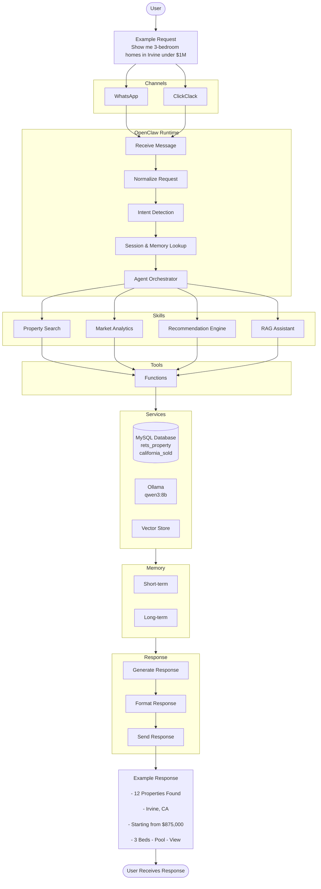

# WEEK 1 - OpenClaw Architecture Fundamentals

## Overview
OpenClaw is a multi-agent orchestration runtime. It does not answer questions itself; instead, it receives a user's request, determines what the user wants, routes the request to the correct AI skill, interacts with external tools such as MySQL or Ollama, stores conversation context, and returns the final response.
The architecture below illustrates how a user request travels through the entire system.

---

## Concepts
- **Channel**: The interface used to communicate with the AI.
- **OpenClaw Runtime**: Central processing engine.
- **Intent Detection**: Identifies what the user wants.
- **Agent Orchestrator**: Select which skills should process the request.
- **Skills**: Specialized modules that perform specific tasks such as property search, market analytics, recommendations, or knowledge retrieval.
- **Tools**: Functions that skills call to interact with databases, models, or external services.
- **Session**: Per-user conversation state during a chat.
- **Short-term Memory**: Stores the session information.
- **Long-term Memory**: Stores information across conversations.
- **Response**: Formats and sends the final response back to the user through the selected communication channel.

## OpenClaw Architecture Workflow

# Current Environment

## Runtime
- OpenClaw

## Model
- Ollama (qwen3:8b)

## Database
- MySQL 8 (Docker)

### Tables:
- rets_property
- california_sold

## Communication Channels
- ClickClack (For testing)
- WhatsApp

