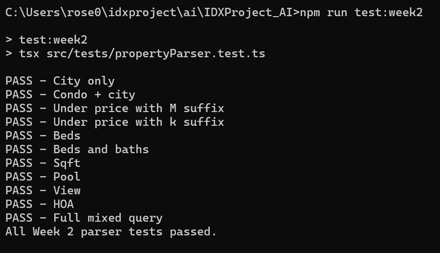

# WEEK 2 - Natural Language Property Search
Build a Natural Language Processing parser that converts free-text real estate search queries into structured filter objects.

## Project structure
- IDXProject_AI
  - src/
      - parser/
          - propertyParser.ts
      - tests/
          - propertyParser.test.ts
      - types/
          - propertyFilters.ts
  - package.json
  - tsconfig.json


## Features Implemented
The parser currently extracts the following search filters from natural language:
- City
- Max Price
- Min Bedrooms
- Min Bathrooms
- Min Sqft
- Property Type
- Pool
- View
- Max HOA (Association Fee)

## Test Cases
The parser was validated using multiple search queries.
- Homes in Irvine 
- Condos in Irvine
- Homes under $1.5M 
- Homes under $850k 
- 3 bedroom homes
- 4 beds 3 baths in Pasadena
- Single family homes over 2000 sqft
- Homes with pool
- Homes with mountain view
- Condo with max HOA 500
- 3-bedroom condo in Irvine under $1.2M with pool and view
**Result:** All test cases passed successfully.

## Challenges Encountered
### Property Type Detection
The parser initially failed to recognize the plural word `condos`.
This was resolved by updating the regular expression to support optional plural forms.

### Bedroom Parsing
The parser initially failed to detect hyphenated values like `3-bedroom`
The regular expression was modified to recognize:
- 3 bedroom
- 3-bedroom
- 3 beds
- 3-bed

## Install Node.js type definitions
```bash
npm install -D @types/node
```

## Run Tests
```bash
npm run test:week2
```

## Deliverable
