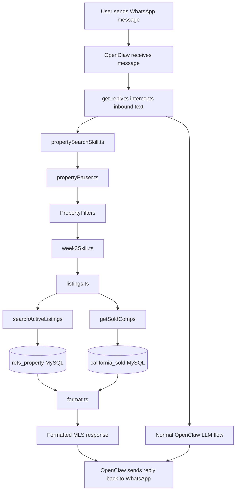
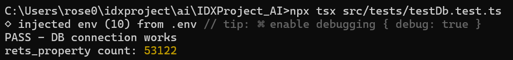
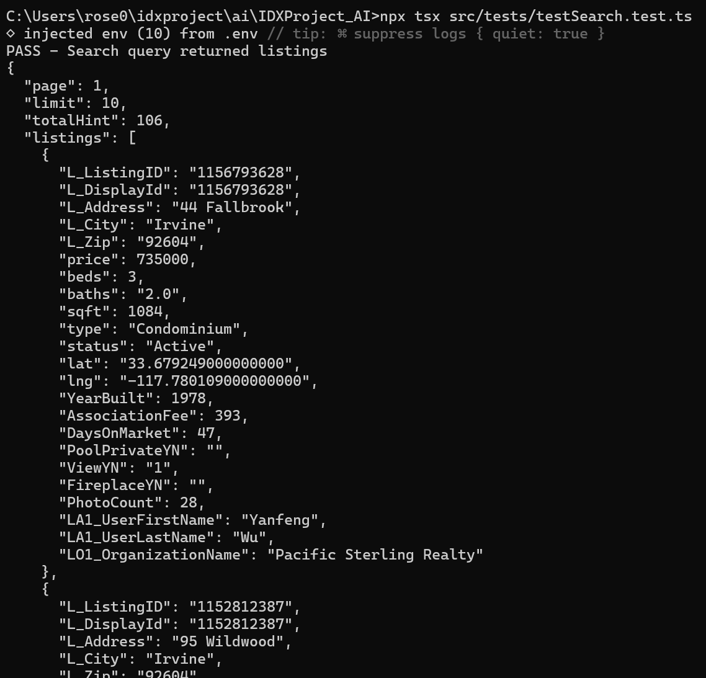
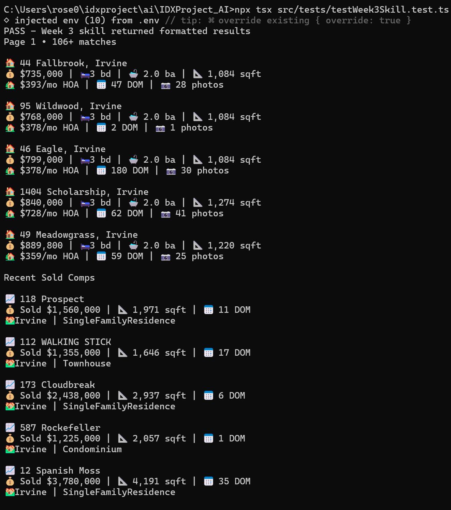
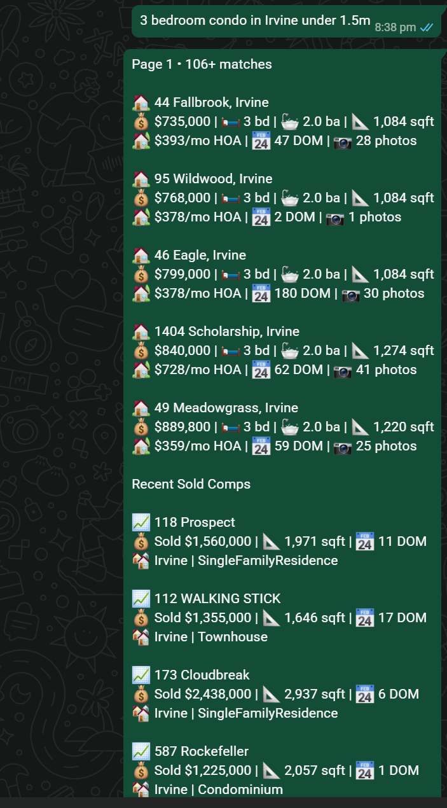

# WEEK 3 - MLS Database Integration
Connect the NLP property parser to the MLS database and return live property search results through OpenClaw and WhatsApp.

## Project structure
- IDXProject_AI
    - src/
      - config/
        - db.ts
      - services/
        - listings.ts
        - format.ts
      - skills/
        - week3Skill.ts
        - propertySearchSkill.ts
      - parser/
        - propertyParser.ts
      - types/
        - propertyFilters.ts
      - tests/
        - testDb.test.ts
        - propertyParser.test.ts
        - week3Search.test.ts
    - OpenClaw
      - src/
        - idx/
          - property-search.ts
        - auto-reply/
        - reply/
          - get-reply.ts
    - package.json
    - tsconfig.json

## OpenClaw Integration
To enable natural language property searches through WhatsApp, the OpenClaw runtime was customized to integrate with the `IDXProject_AI` project.

The following OpenClaw source files were modified:
- **src/idx/property-search.ts**
  - Added a custom property search router that bridges OpenClaw with the Week 3 MLS search services.

- **src/auto-reply/reply/get-reply.ts**
  - Modified the reply pipeline to intercept natural language property search requests before the normal LLM workflow.
  - Routed property search queries directly to the NLP parser and MLS database.
  - Returned formatted MLS search results through the WhatsApp channel.

> **Note:** These OpenClaw source files have been included in this repository under the **OpenClaw** folder for documentation purposes to demonstrate the integration completed during Week 3.


## File Dependencies
The Week 3 MLS search workflow is divided into multiple modules, each responsible for a specific part of the property search process.

### 1. `propertyFilters.ts`
Defines the data structures used throughout the application.
- Defines the `PropertyFilters` interface used by the NLP parser.
- Defines the `ListingRow` interface for active MLS listings.
- Defines the `SoldRow` interface for recent sold comparable properties.
- Creates an empty filter object used as the starting point for every search.

### 2. `propertyParser.ts`
Converts natural language into structured search filters.
- Extracts city, price, bedrooms, bathrooms, square footage, property type, pool, view, and HOA information.
- Converts free-text property search requests into a `PropertyFilters` object.
Example:
```text
3 bedroom condo in Irvine under 1.5M with pool
```
```typescript
{
  city: "Irvine",
  beds: 3,
  maxPrice: 1500000,
  type: "Condominium",
  pool: "True"
}
```

### 3. `propertySearchSkill.ts`
Acts as the entry point for all property searches.
- Receives the user's property search request.
- Calls the NLP parser.
- Passes the extracted filters to the Week 3 search workflow.

### 4. `week3Skill.ts`
Coordinates the complete MLS search process.
- Searches active listings.
- Retrieves recent sold comparable properties.
- Combines and formats the final response returned to the user.

### 5. `listings.ts`
Implements the database layer.
- Connects to the MLS database.
- Builds parameterized SQL queries.
- Searches the `rets_property` table for active listings.
- Searches the `california_sold` table for recent sold comparable properties.
- Supports pagination.

### 6. `format.ts`
Formats the database results into user-friendly responses.
- Formats active listing information.
- Formats sold comparable properties.
- Produces the final response displayed in WhatsApp.

## Overall Workflow


## Features Implemented
The Week 2 NLP parser was integrated with the MLS database to perform live property searches.

Implemented features include:
- MySQL database connectivity using `mysql2`
- Environment-based database configuration using `.env`
- Active property search from the `rets_property` database
- Recent sold comparable property search from the `california_sold` database
- Dynamic query generation based on NLP parser output
- Pagination support for search results
- Formatted active listing responses
- Formatted recent sold comparable property responses
- Integration between the NLP parser and MLS database
- Custom OpenClaw property search routing
- WhatsApp integration through OpenClaw
- Automatic detection and routing of property search requests
- Direct MLS database retrieval without invoking the LLM
- End-to-end natural language property search through WhatsApp

## Test Cases
The Week 3 MLS database integration was validated using the following tests.
- Database connection test
  - Verified successful connection to the MySQL database.
  - Confirmed the `rets_property` table could be queried successfully.

- Property search test
  - Query: `3 bedroom condo in Irvine under $1.5M`
  - Verified matching active listings were returned.
  - Verified pagination information was generated correctly.

- Week 3 integration test
  - Query: `3 bedroom condo in Irvine under $1.5M`
  - Verified the NLP parser extracted the correct search filters.
  - Verified active listings and recent sold comparable properties were retrieved.
  - Verified the response was formatted correctly for WhatsApp.

**Result:** All test cases passed successfully.

## Challenges Encountered
### Connecting OpenClaw to the MLS Database
The OpenClaw runtime originally routed every incoming message through the LLM.
This was resolved by modifying the reply pipeline (`get-reply.ts`) to detect property search queries and directly invoke the MLS search skill before the normal agent execution.

### Environment Variable Loading
The database connection initially failed because the OpenClaw runtime was executing outside the `IDXProject_AI` project directory, preventing `dotenv` from loading the correct `.env` file.
This was resolved by explicitly loading the correct `.env` file before creating the MySQL connection.

### OpenClaw Integration
Instead of using the OpenClaw plugin system, a custom routing layer was added to intercept property search requests and connect them directly to the NLP parser and MLS database.
This enabled property searches to bypass the LLM while allowing all other conversations to continue through the normal OpenClaw workflow.


## Install Dependencies
### In `IDXProject_AI`
```bash
npm install
npm install mysql2 dotenv
npm install -D typescript ts-node @types/node
```

### In `OpenClaw`
```bash
corepack pnpm install
```

## Run Tests
###  Run all tests
```bash
npm run test:week3
```

### Run DB connection test
```bash
npx tsx src/tests/testDb.test.ts
```
### Run search query returns listings test
```bash
npx tsx src/tests/testSearch.test.ts
```
### Run week 3 skill formatted results test
```bash
npx tsx src/tests/testWeek3Skill.test.ts
```

## Deliverables
### Database Connection Test


### Property Search Query Test


### Week 3 Skill Test


### WhatsApp Integration



