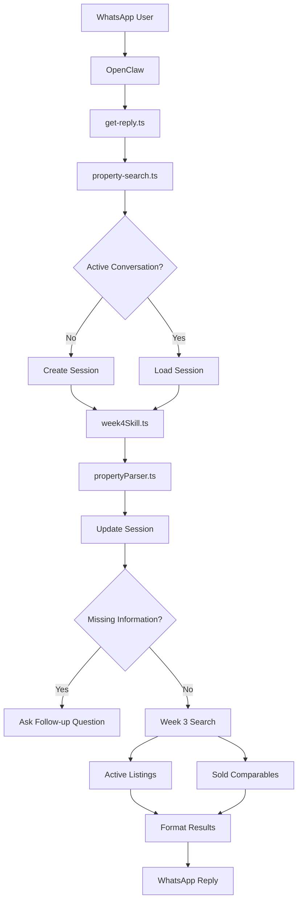
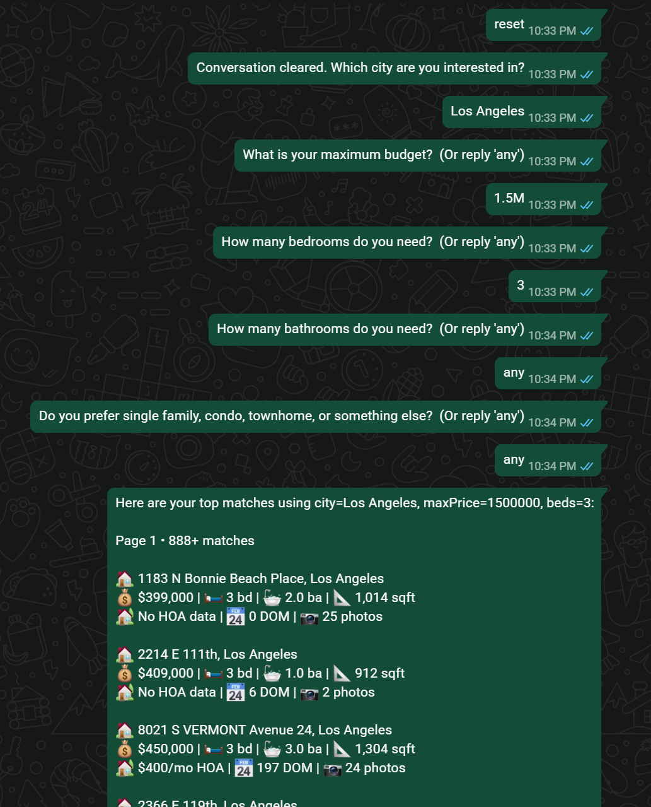
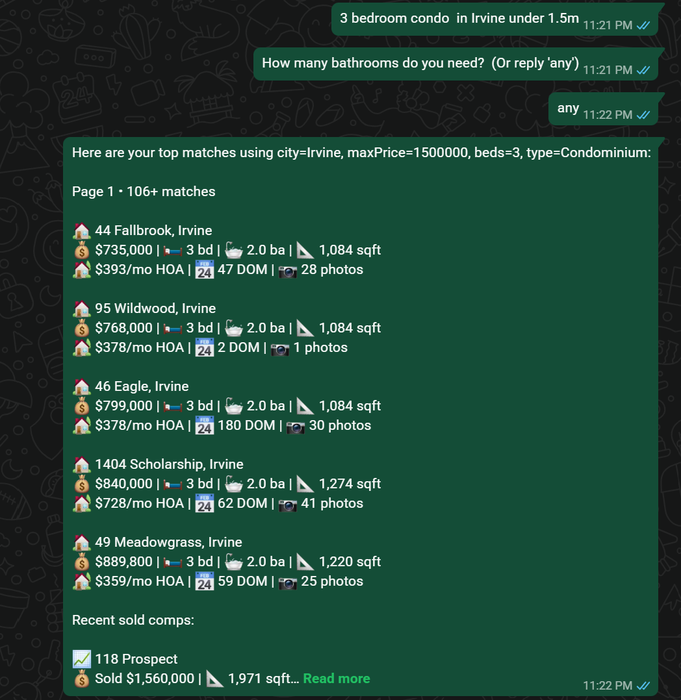
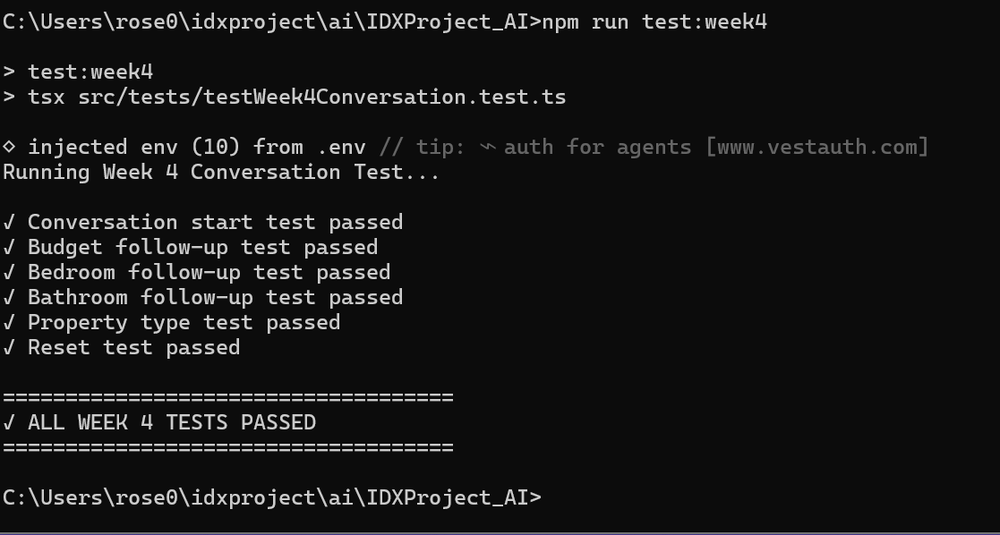

# WEEK 4 - Conversational Property Search Agent
Week 4 builds upon the Week 3 MLS database integration by introducing conversational memory. Rather than requiring users to provide all search filters in a single request, the assistant now maintains conversation state, asks follow-up questions for missing information, remembers user preferences throughout the session, and progressively builds a complete property search before querying the MLS database.

## Project structure
- IDXProject_AI
    - src/
      - config
      - services
      - session/
        - sessionManager.ts
      - skills/
        - week4Skill.ts
      - parser
      - types/
        - propertyFilters.ts
      - tests/
        - week4Conversation.test.ts
    - OpenClaw
      - src/
        - idx/
          - property-search.ts
        - auto-reply/
        - reply/
          - get-reply.ts

## OpenClaw Integration
The OpenClaw runtime was extended to support conversational property searches.

The following OpenClaw source files were modified:
- **src/idx/property-search.ts**
  - Detects property search requests.
  - Checks whether the user already has an active conversation.
  - Routes property-related messages into the Week 4 conversation handler.
  - Supports resetting conversations.
  - Allows normal OpenClaw conversations to continue unaffected.

- **src/auto-reply/reply/get-reply.ts**
  - Intercepts inbound WhatsApp messages.
  - Uses the raw WhatsApp message body.
  - Sends property requests directly into Week 4.
  - Returns formatted conversational replies back to WhatsApp.

> **Note:** These OpenClaw source files have been included in this repository under the **OpenClaw** folder for documentation purposes to demonstrate the integration completed during Week 4.


## Files

### 1. `sessionManager.ts`
Maintains conversation state for each user.
- Create new sessions
- Retrieve existing sessions
- Update conversation state
- Reset conversations
- Clear conversations
Each user has an independent session allowing multiple users to search simultaneously.

### 2. `propertyFilters.ts`
Defines all shared interfaces.
- PropertyFilters
- ListingRow
- SoldRow
- UserSession
The UserSession stores:
- city
- budget
- bedrooms
- bathrooms
- property type
- pool
- view
- HOA
- last search results
- current conversation step
- awaiting question
- answered flags

### 3. `week4Skill.ts`
Acts as the central conversation engine for the Week 4 property assistant.
- Loads user session
- Parses every user message
- Updates session memory
- Determines missing information
- Generates follow-up questions
- Executes MLS searches
- Retrieves recent sold comparable properties
- Supports conversation reset

## Overall Workflow


## Features Implemented
Implemented features include:
- Multi-turn property conversations
- Per-user session memory
- Conversation reset
- Progressive filter collection
- Follow-up questions
- Automatic MLS search once required filters are collected
- Retrieval of active listings
- Retrieval of sold comparable properties
- Search refinement
- Session persistence throughout the conversation
- WhatsApp conversational interface
- Integration with OpenClaw reply pipeline

Additional conversation features include:
- Support for restarting searches without affecting other users
- Flexible responses such as "any", "no preference", and "doesn't matter"

### Handling Flexible User Responses
Users may not always have a preference for every property attribute.
The conversation flow was updated to recognize responses such as:
- any
- no preference
- doesn't matter
while still allowing the search to continue naturally.

## Test Cases
The Week 4 conversational workflow was validated using the following tests.
- Conversation flow test
  - Sequence: `Find homes in Irvine` → `Under $1.2M` → `3 bedrooms` → `any` → `single family`
  - Verified the assistant progressively collected filters and returned MLS results.

- Reset test
  - Query: `reset`
  - Verified the session was cleared and a new conversation started.

- No-preference response test
  - Query: `any`
  - Verified the assistant accepted flexible responses and continued the conversation.

**Result:** The Week 4 multi-turn conversation passed successfully.

## Challenges Encountered
### Keeping Conversation State Consistent
The assistant needed to remember which filter was being requested and avoid asking the same question repeatedly. This was resolved by tracking session memory with answer flags such as `priceAnswered`, `bedsAnswered`, `bathsAnswered`, and `typeAnswered`.

### Handling Flexible User Responses
Users may not always have a preference for every property attribute. The conversation flow was updated to recognize responses such as `any`, `no preference`, and `doesn't matter` while still continuing the search naturally.

### Avoiding Self-Message Loops
OpenClaw initially reprocessed outbound replies as if they were new inbound messages. This was resolved by using the raw message body and filtering wrapper text so the assistant only processes actual user input.

### Resetting Conversations
Restarting a search while preserving normal conversations required implementing a session reset mechanism.
Users can now restart a property search at any time using commands such as:
- reset
- start over

## Run Tests
###  Run Week 4 conversation test
```bash
npm run test:week4
```
### Run the test directly
```bash
npx tsx src/tests/testWeek4Conversation.test.ts
```

## Deliverables
### Multi-turn WhatsApp Conversation
#### Example 1 


#### Example 2 


### Conversation Reset


### Week 4 Conversation Test



