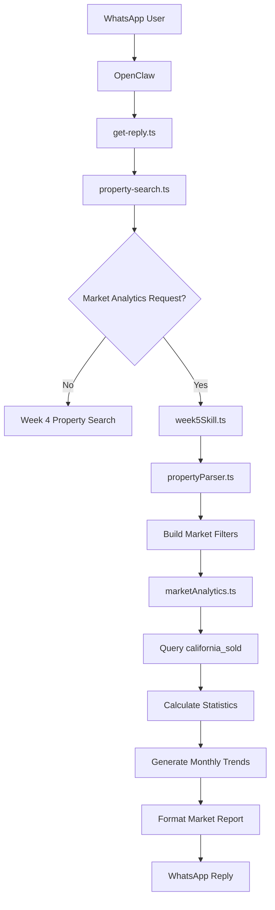
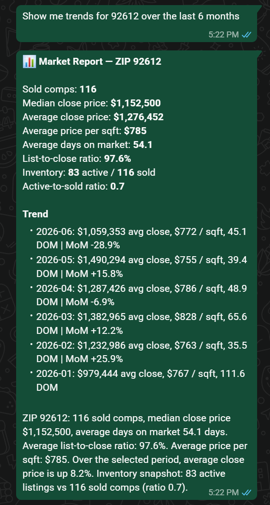
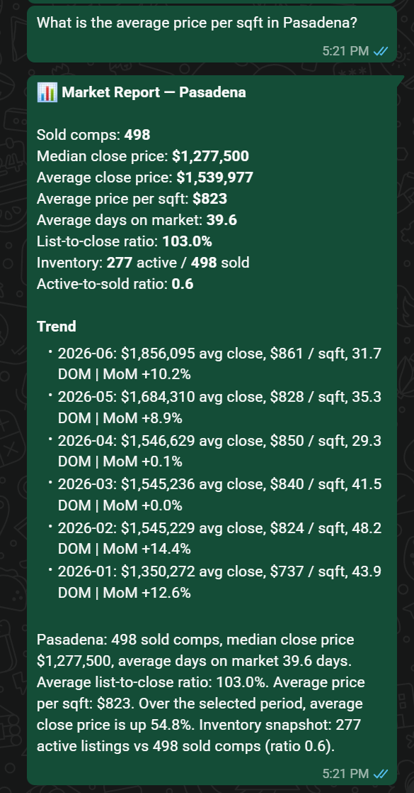
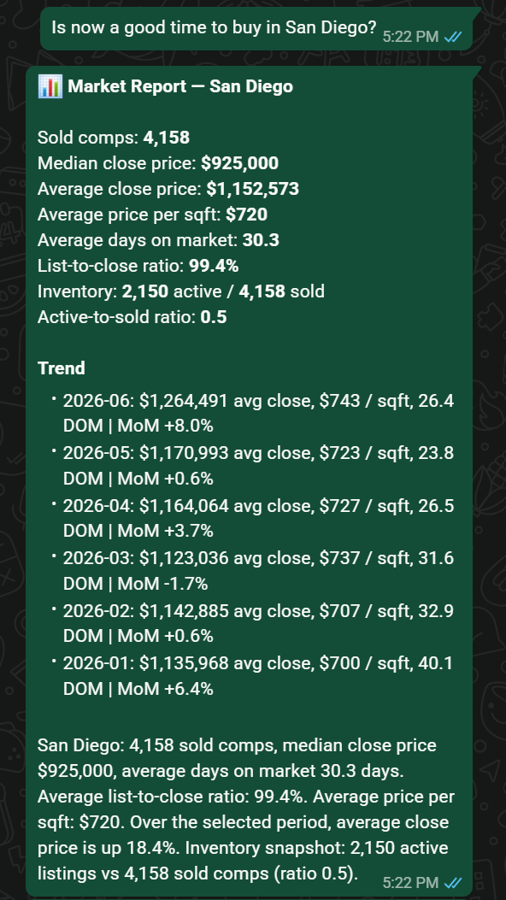
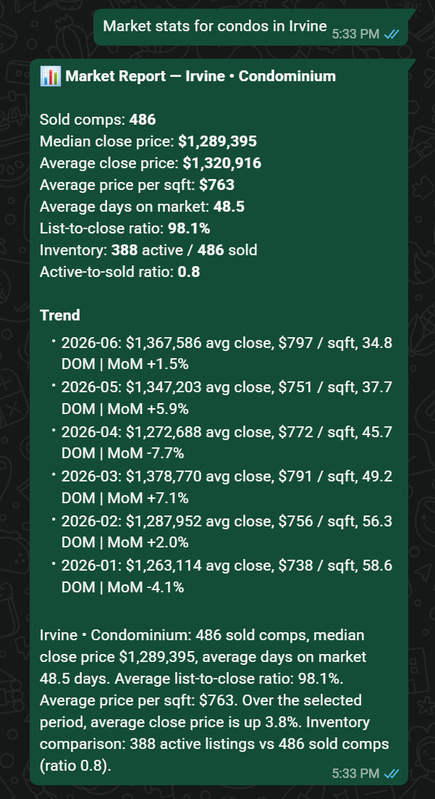
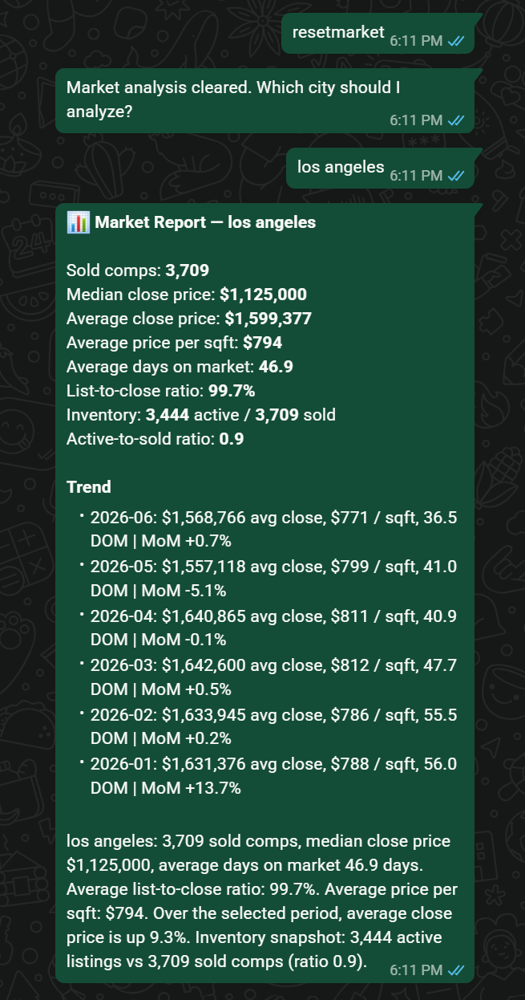
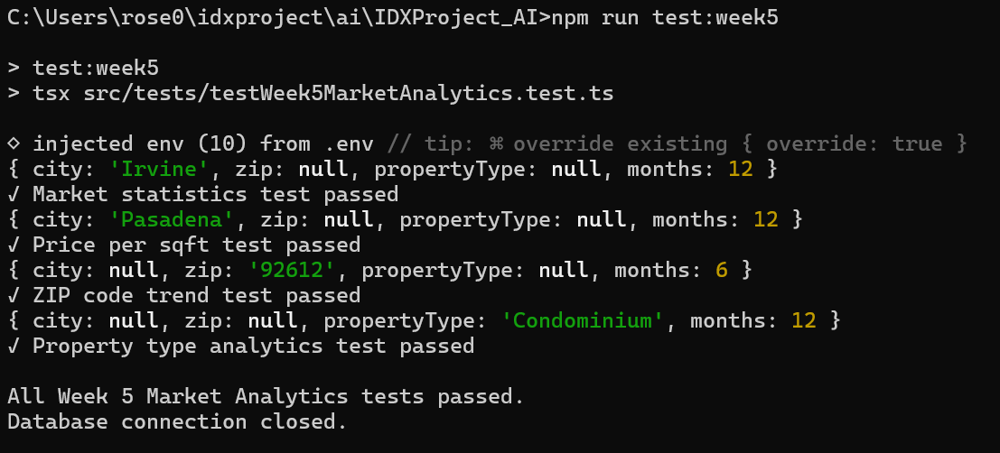

# WEEK 5 - Market Statistics Agent
Week 5 extends the property search assistant by introducing a Market Analytics Agent powered by the `california_sold` database. Instead of returning individual listings, the assistant analyzes historical sales data to generate market reports for a specified city, ZIP code, or property type. The agent provides key market statistics including average and median sale prices, price per square foot, days on market, inventory comparisons, and monthly pricing trends to help users better understand local real estate market conditions.

## Project structure
- IDXProject_AI
    - src/
      - config
      - services/
        - marketAnalytics.ts
      - session/
        - sessionManager.ts
      - skills/
        - week5Skill.ts
      - parser/
        - propertyParser.ts
      - types/
        - marketAnalytics.ts
      - tests/
        - week5MarketAnalytics.test.ts
    - OpenClaw
      - src/
        - idx/
          - property-search.ts
        - auto-reply/
        - reply/
          - get-reply.ts

## OpenClaw Integration
The OpenClaw runtime was extended to support conversational market analytics.

The following OpenClaw source files were modified:
- **src/idx/property-search.ts**
  - Detects market analytics requests.
  - Routes market-related questions to the Week 5 skill.
  - Supports resetting market conversations.
  - Maintains separate routing for property search and market analytics.

- **src/auto-reply/reply/get-reply.ts**
  - Intercepts inbound WhatsApp messages.
  - Uses the raw WhatsApp message body.
  - Routes market requests directly into the Market Analytics Agent.
  - Returns formatted market reports to WhatsApp.

> **Note:** These OpenClaw source files have been included in this repository under the **OpenClaw** folder for documentation purposes to demonstrate the integration completed during Week 4.


## Files

### 1. `marketAnalytics.ts`
Implements all database queries for market analytics.
Features include:
  - Sold property statistics
  - Median close price calculation
  - Average close price
  - Average price per square foot
  - Average days on market
  - List-to-close ratio
  - Active inventory comparison
  - Monthly trend calculations
  - Month-over-month price changes
  - Year-over-year comparisons
### 2. `marketAnalytics.ts` (types)
Defines all shared interfaces.
Includes:
  - MarketFilters
  - MarketSummary
  - MonthlyTrendRow
  - InventoryComparision
  - MarketReport
These interfaces provide a structured representation of market reports returned to the user.

### 3. `week5Skill.ts`
Acts as the central controller for the Market Analytics Agent.
  - Parsing market-related requests
  - Extracting location information
  - Determining reporting period
  - Managing market conversation state
  - Building market reports
  - Formatting analytics for WhatsApp
  - Supporting market session reset

### 4. `propertyParser.ts`
The existing NLP parser was extended to support market analytics without creating a separate parser.
Additional parsing capabilities include:
  - ZIP code extraction
  - Time period extraction
  - City extraction from market questions
  - Reuse of existing property type detection
This allows a single parser to support both property searches and market analytics.

## Overall Workflow


## Features Implemented
Implemented features include:
  - Market analytics using historical sold properties
  - Average close price
  - Median close price
  - Average price per square foot
  - Average days on market
  - List-to-close ratio
  - Active versus sold inventory comparison
  - Monthly trend reporting
  - Month-over-month price comparison
  - Year-over-year price comparison
  - Support for city searches
  - Support for ZIP code searches
  - Support for property type filtering
  - WhatsApp integration
  - OpenClaw reply pipeline integration

Additional conversation features include:
- Support for restarting searches without affecting other users

### Supported Queries Example
- Market stats in Irvine
- What is the average price per sqft in Pasadena?
- Is now a good time to buy in San Diego?
- Show me trends for 92612 over the last 6 months
- Market stats for condos in Irvine


## Test Cases
The Week 5 market analytics workflow was validated using the following tests
- Market statistics
  - Query: `Market stats in Irvine`
  - Verified:average price, median price, DOM, inventory, trends.

- Price per square foot
  - Query: `What is the average price per sqft in Pasadena?`
  - Verified correct city parsing and calculation.

- ZIP code search
  - Query: `Show me trends for 92612 over the last 6 months`
  - Verified ZIP code parsing and monthly trend generation.

- Property type search
  - Query: `Market analytics for condominiums`
  - Verified filtering using property subtype.

**Result:** The Week 5 multi-turn market analytics passed successfully.

## Challenges Encountered
### Parsing Market Questions
Unlike property searches, market questions are phrased in many different ways. The existing NLP parser was extended to extract cities, ZIP codes, property types, and reporting periods while reusing the same parsing infrastructure developed in earlier weeks.

### Database Aggregations
Several statistics required SQL aggregate calculations, including average prices, median prices, average days on market, list-to-close ratios, and monthly trend analysis. Additional formatting was required because aggregate values returned from MySQL needed conversion before being used within TypeScript.

### Session Management
Market conversations required their own conversational state while remaining independent from the existing property search conversations. Separate session tracking was implemented to prevent market requests from interfering with ongoing property searches.

### OpenClaw Integration
Integrating a second conversational skill into the OpenClaw routing pipeline required distinguishing between property search requests and market analytics requests while preserving the existing WhatsApp conversation flow.

## Resetting Conversations
Restarting a search while preserving normal conversations required implementing a session reset mechanism.
Users can now restart a property search at any time using commands such as:
- resetmarket
- start over market

## Run Tests
###  Run Week 5 Market analytics
```bash
npm run test:week5
```
### Run the test directly
```bash
npx tsx src/tests/week5MarketAnalytics.test.ts
```

## Deliverables
### Market Analytics Report
#### Example 1 


#### Example 2 


#### Example 3


#### Example 4


#### Example 5 - Reset


### Week 5 Test



