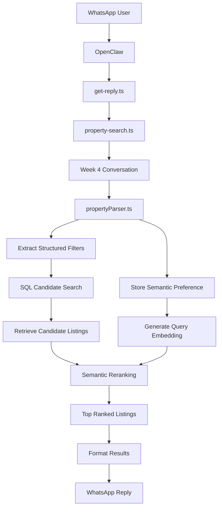
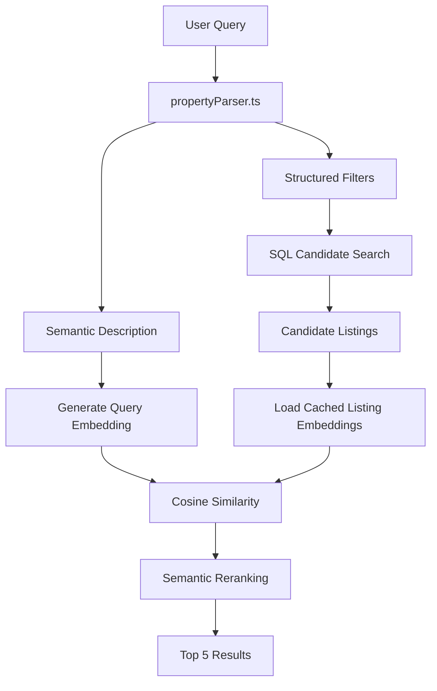
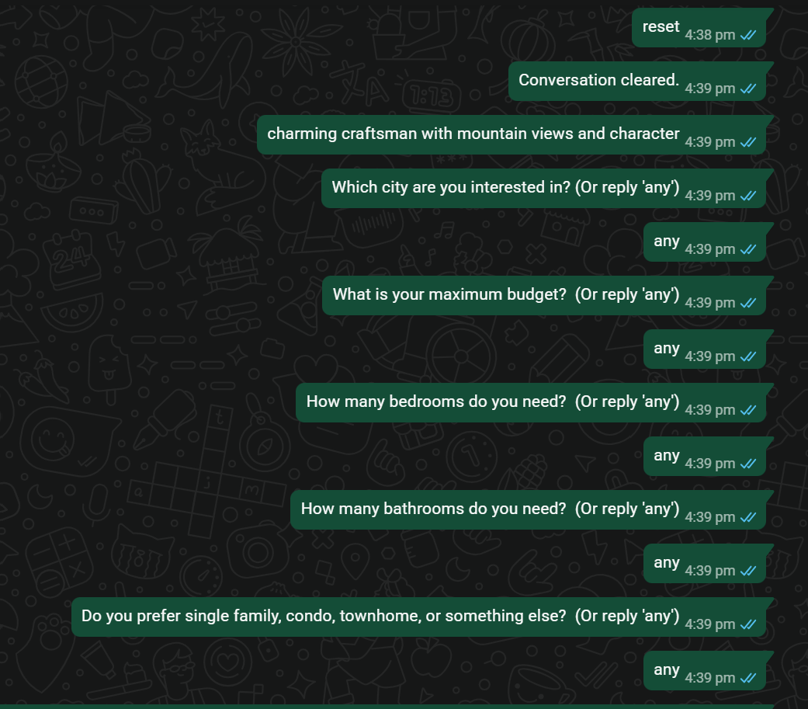
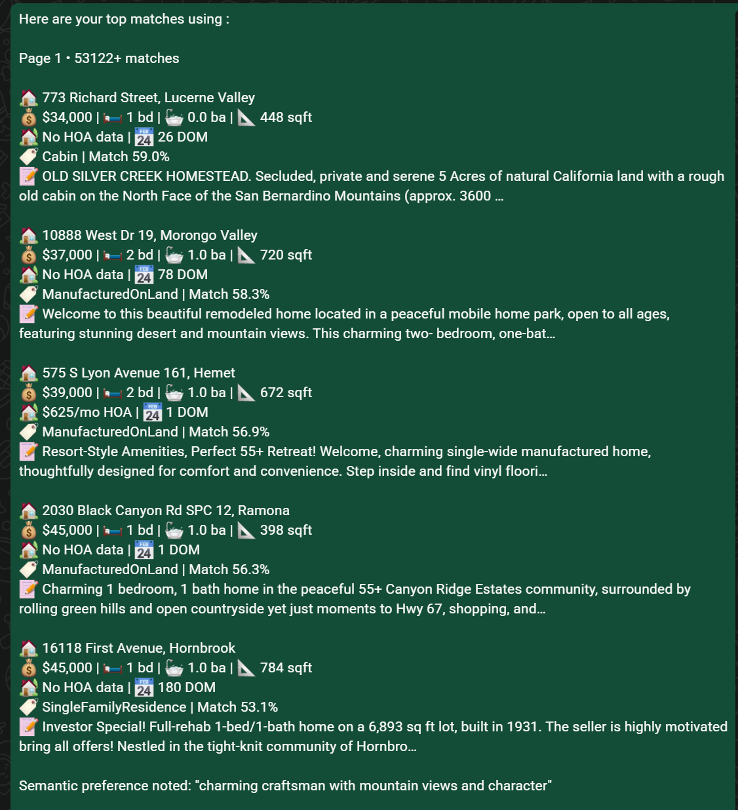
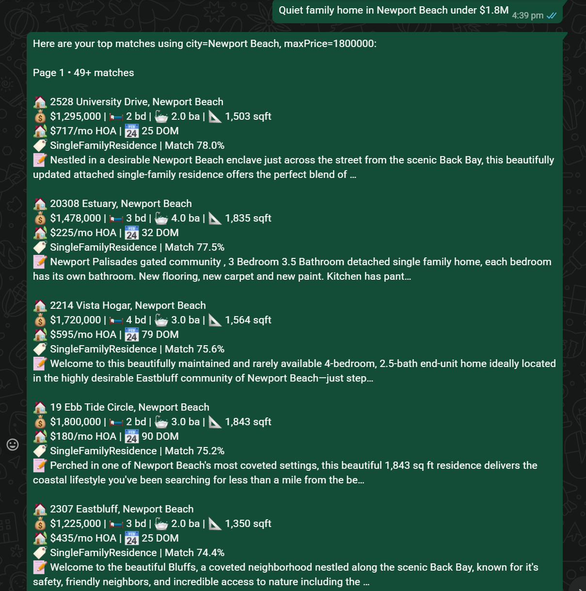
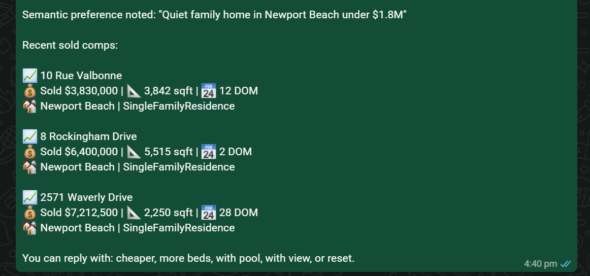
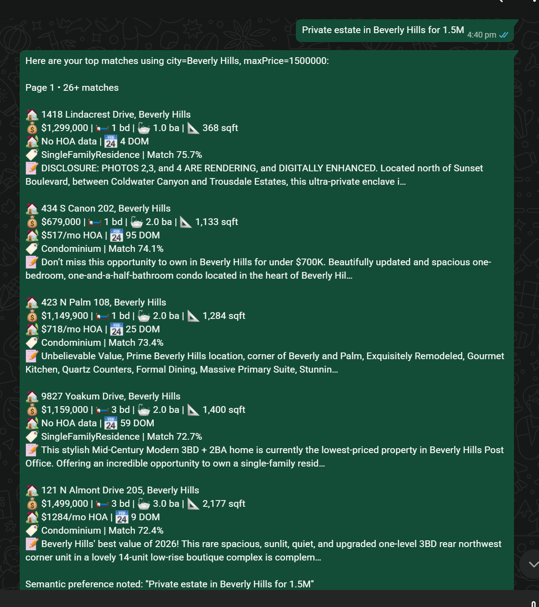
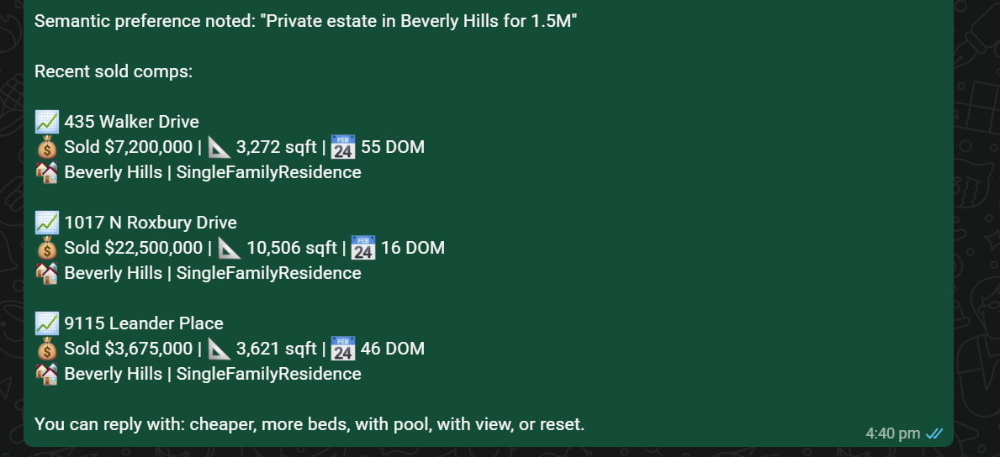
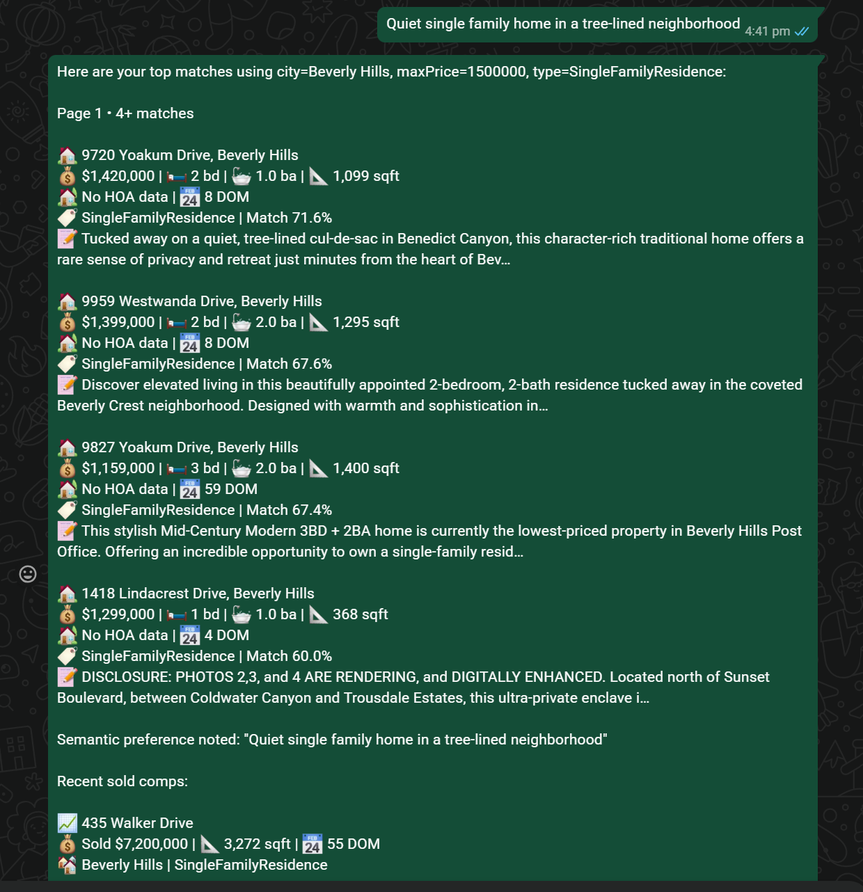
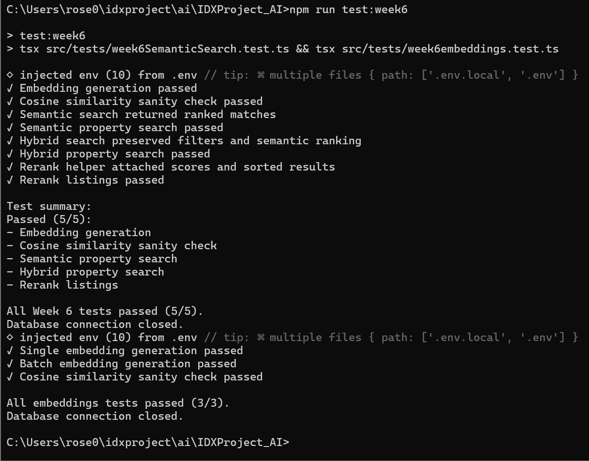

# WEEK 6 - Embeddings & Vector Search
Week 6 extends the conversational property search assistant by introducing semantic property search using vector embeddings. Instead of relying solely on exact structured filters, the assistant now understands descriptive natural language such as "quiet family home", "private estate", "modern open concept", or "charming craftsman with character" and rank matching properties by semantic similarity.

A hybrid search approach was implemented where structured SQL filters first retrieve a candidate set of listings, and semantic similarity is then used to rerank those candidates based on the user's natural language description. This allows the assistant to combine traditional MLS filtering with AI-powered semantic understanding while keeping the conversation flow inside Week 4.

## Project structure
- IDXProject_AI
    - src/
      - config
      - services/
        - embeddings.ts
        - semanticSearch.ts
      - session
      - skills
      - parser
      - types
      - tests/
        - week6SemanticSearch.test.ts
        - week6embeddings.test.ts
    - OpenClaw
      - src/
        - idx/
          - property-search.ts
        - auto-reply/
        - reply/
          - get-reply.ts

## OpenClaw Integration
The OpenClaw routing pipeline was updated so that all property-related requests continue through Week 4, while semantic ranking is handled behind the scenes by the semantic search service.
The following OpenClaw source files were modified:
- **src/idx/property-search.ts**
    - Routes property conversations into Week 4.
    - Preserves multi-turn conversations.
    - Supports semantic property descriptions.
    - Prevents routing loops.

- **src/auto-reply/reply/get-reply.ts**
    - Handles WhatsApp conversations.
    - Routes semantic search requests.
    - Returns formatted semantic search results.

> **Note:** These OpenClaw source files have been included in this repository under the **OpenClaw** folder for documentation purposes to demonstrate the integration completed during Week 6. 


## Files
### 1. `embeddings.ts`
Implements communication with the local Ollama embedding model.
Features include:
- Local embedding generation
- Batch embedding support
- Text preprocessing
- Cosine similarity calculation
- No OpenAI API dependency

### 2. `semanticSearch.ts`
Implements the semantic search engine.
Features include:
- Candidate retrieval
- Cached embedding lookup
- Automatic embedding generation for new listings
- Cosine similarity ranking
- Semantic reranking of SQL results
- Listing embedding cache management

### 3. `week4Skill.ts`
Acts as the central controller for the conversational property search assistant.
It now supports semantic search by:
- Managing multi-turn property conversations
- Extracting structured property filters
- Storing semantic preferences
- Performing hybrid SQL + semantic search
- Reranking SQL candidates using embeddings
- Returning the top ranked listings

> **Note:** The semantic search behavior is now integrated into the Week 4 property conversation flow. There is no separate Week 6 skill file in the implementation.

### 4. `propertyParser.ts`
The NLP parser was extended to better distinguish between structured filters and semantic descriptions.
Additional parsing capabilities include:
- Improved city extraction
- Property type extraction
- Semantic phrase detection
- Mixed structured and descriptive query parsing
This allows a single parser to support property searches, market analytics and semantic search.

## Local Embedding Model
The initial implementation of semantic search was designed to use the OpenAI Embeddings API for generating vector representations of property descriptions. However, relying on a cloud-based API introduced recurring usage costs and required internet connectivity.
To eliminate external API costs and allow the system to run completely offline, the implementation was migrated to **Ollama** using the **nomic-embed-text** embedding model.
The `embeddings.ts` service communicates directly with the locally running Ollama server to generate embeddings for both property listings and user queries.

### Embedding Model
```
Model: nomic-embed-text
```

### Pull the Embedding Model
```bash
ollama pull nomic-embed-text
```

### Verify the Installation
```bash
ollama list
```

## Embedding Cache Database
To improve semantic search performance, a dedicated MySQL table named `listing_embeddings` was introduced to cache embeddings for property listings.
Instead of generating embeddings for every listing during each search, embeddings are generated once and stored in the database. During subsequent searches, the cached embeddings are retrieved and only the user's query embedding needs to be generated. This significantly reduces the number of embedding requests and improves overall search performance.

### Database Schema
```sql
CREATE TABLE IF NOT EXISTS listing_embeddings (
  id BIGINT AUTO_INCREMENT PRIMARY KEY,
  listing_id VARCHAR(64) NOT NULL UNIQUE,
  embedding_json JSON NOT NULL,
  source_text LONGTEXT NOT NULL,
  updated_at TIMESTAMP DEFAULT CURRENT_TIMESTAMP
    ON UPDATE CURRENT_TIMESTAMP
);
```

### Table Columns
- `listing_id`: Unique MLS listing identifier.
- `embedding_json`:Stores the vector embedding generated by the local Ollama embedding model.
- `source_text`: Stores the text used to generate the embedding, including property remarks and metadata.
- `updated_at`: Timestamp used to track when an embedding was last generated or updated.

## Overall Workflow


## Hybrid Search Pipeline


## Features Implemented
Implemented features include:
- Semantic property search
- Hybrid SQL + semantic search
- Local semantic embeddings using Ollama
- Offline vector generation with the nomic-embed-text model
- Cached embedding storage in MySQL
- Cosine similarity ranking
- Natural language property descriptions
- Semantic reranking of SQL results
- Multi-turn conversations
- Session persistence
- WhatsApp integration
- OpenClaw routing integration

Additional conversation features include:
- Structured and semantic search together

### Supported Queries Example
- Luxury condo near the beach with resort-style amenities
- charming craftsman with mountain views and character
- Quiet single family home in a tree-lined neighborhood
- Quiet family home in Newport Beach under $1.8M
- Private estate in Beverly Hills for 1.5M

## Test Cases
The Week 6 semantic property search implementation was validated using two automated test suites that verify the embedding engine, semantic search pipeline, hybrid search workflow, and semantic reranking.

### 1. Embedding Validation
The embedding engine was tested using `week6embeddings.test.ts`.

#### Single Embedding Generation
**Test Description**
Generate an embedding for a natural language property description.

**Query**
```text
charming craftsman with mountain views
```

**Verified**
- Successful connection to the local Ollama embedding model
- Embedding vector generated successfully
- Returned embedding contains valid numerical values
- Embedding dimensions are valid

---

#### Batch Embedding Generation
**Test Description**
Generate embeddings for multiple property descriptions simultaneously.

**Queries**
```text
charming craftsman with mountain views quiet family home in Newport Beach modern open concept condo
```

**Verified**
- Batch embedding generation completed successfully
- Correct number of embeddings returned
- All embeddings contain valid numerical values
- Embedding dimensions remain consistent across all inputs

---

#### Cosine Similarity Validation
**Test Description**
Validate the cosine similarity implementation using identical and different vectors.

**Verified**
- Identical vectors produce a similarity score close to **1.0**
- Different vectors produce lower similarity scores
- Cosine similarity calculations behave as expected

---

### 2. Semantic Property Search
The semantic search pipeline was tested using `week6SemanticSearch.test.ts`.

#### Semantic Search
**Query**
```text
charming craftsman with mountain views and character
```

**Verified**
- Semantic query embedding generated successfully
- Candidate properties retrieved
- Semantic similarity scores calculated
- Results ranked by cosine similarity
- Returned listings contain valid addresses, cities, and property descriptions

---

#### Hybrid Property Search
**Query**
```text
Quiet family home in Newport Beach under $1.8M
```

**Verified**
- Structured filters extracted correctly
- SQL candidate search executed successfully
- Semantic description preserved
- Candidate listings reranked using embeddings
- Structured filters remained applied after semantic ranking
---

#### Listing Reranking
**Test Description**
Validate semantic reranking using sample property listings.

**Verified**
- Similarity score attached to every listing
- Listings sorted in descending semantic similarity
- Most relevant property ranked first
- No listings removed during reranking

---

### Test Summary
The Week 6 automated test suite validates the following functionality:
- Local embedding generation
- Batch embedding generation
- Cosine similarity calculations
- Semantic property search
- Hybrid SQL + semantic search
- Candidate reranking
- Semantic ranking of property listings

**Result:** All Week 6 embedding and semantic search tests passed successfully.

## Challenges Encountered
### Choosing an Embedding Provider
The initial design considered using the OpenAI Embeddings API to generate vector representations of property descriptions. However, this introduced recurring API costs and required internet connectivity. The implementation was migrated to the local Ollama runtime using the **nomic-embed-text** model, allowing embeddings to be generated completely offline while maintaining good semantic search performance.

### Combining Structured and Semantic Search
One of the biggest challenges was combining SQL filtering with semantic similarity. Initially only a small number of SQL results were reranked, which reduced the effectiveness of semantic search. This was improved by retrieving a larger candidate pool before applying semantic ranking.

### Embedding Performance
Generating embeddings during every search introduced unnecessary overhead. A caching mechanism was implemented using the `listing_embeddings` table so that previously generated embeddings could be reused, significantly improving performance.

### Parser Improvements
Natural language descriptions such as "tree-lined neighborhood" or "quiet family home" initially conflicted with structured city extraction. The parser was refined to better distinguish descriptive phrases from actual city names.

### Conversation Management
Supporting semantic search while maintaining multi-turn conversations required extending the existing session manager to track both structured filters and semantic preferences without interrupting the conversational workflow.

## Run Tests
###  Run Week 6 Tests
```bash
npm run test:week6
```
### Run Embedding Test
```bash
npx tsx src/tests/week6embeddings.test.ts
```
### Run the Semantic Test 
```bash
npx tsx src/tests/week6SemanticSearch.test.ts
```

## Deliverables
### Semantic Search Example
#### Example 1 



#### Example 2 



#### Example 3



#### Example 4


### Week 6 Test



