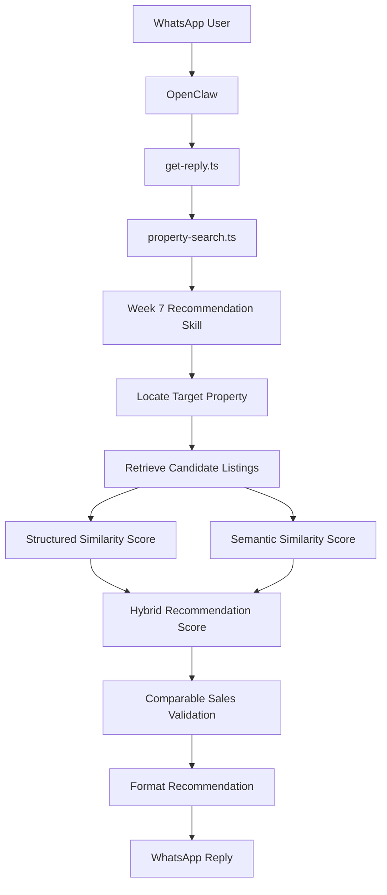
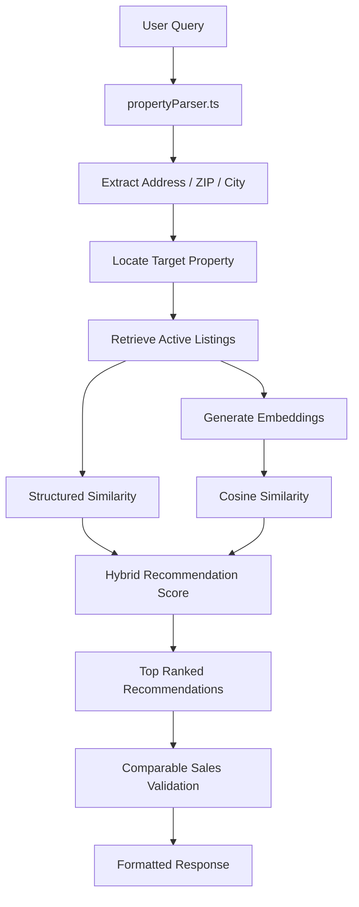
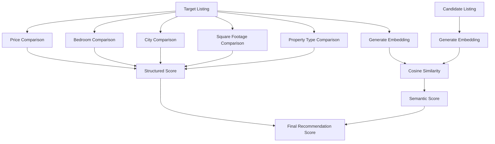
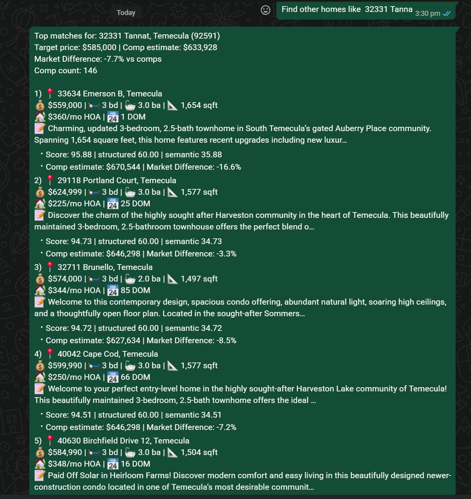
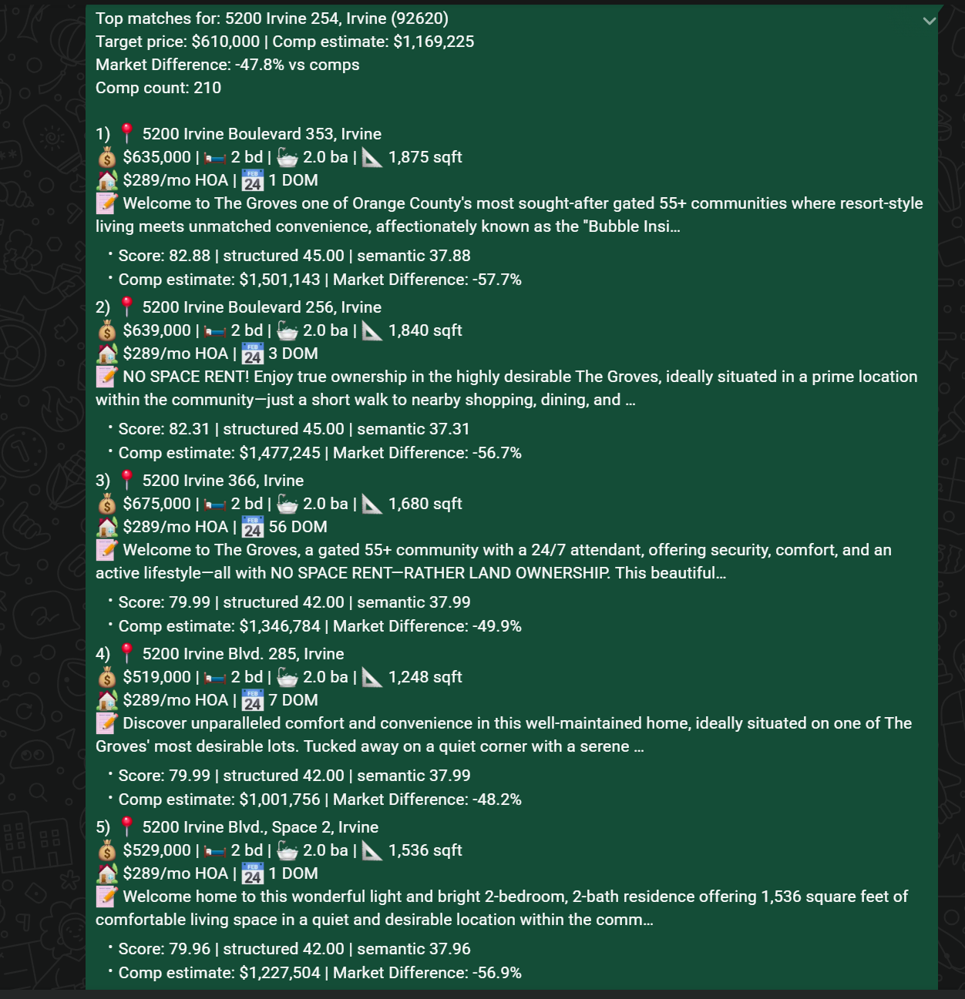
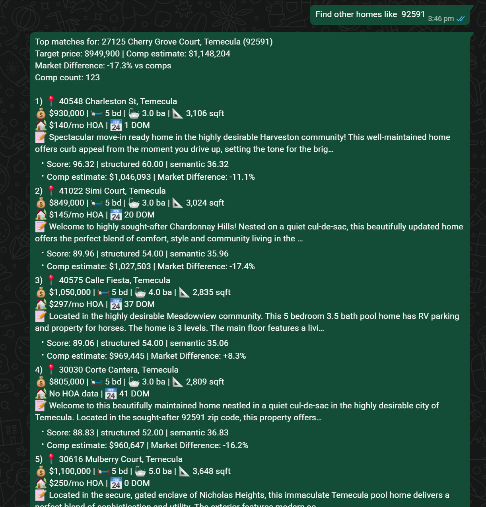
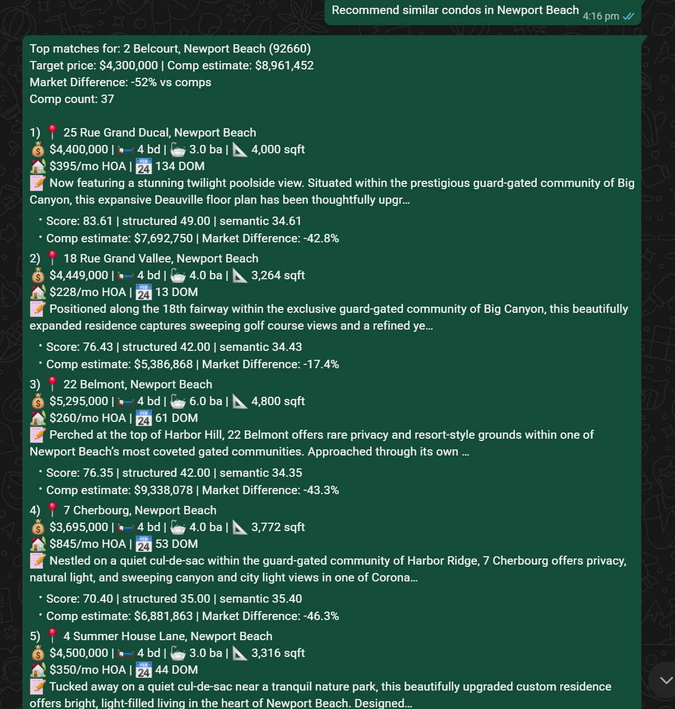
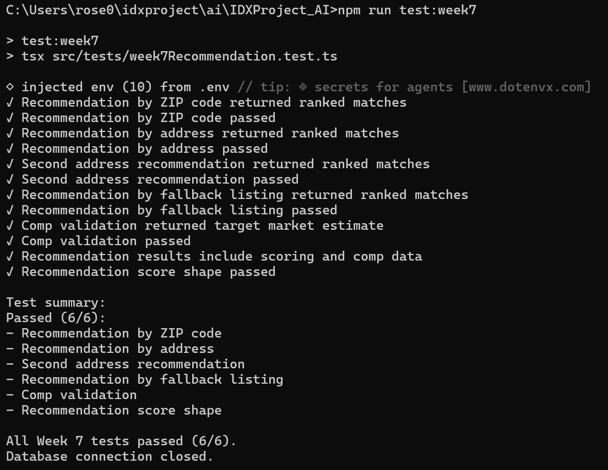

# WEEK 7 - Recommendation Engine
Week 7 extends the conversational property search assistant by introducing a hybrid recommendation engine capable of suggesting similar active listings based on both structured MLS data and semantic property descriptions. Rather than relying only on traditional SQL filtering, the assistant now analyzes the characteristics of a property that the user is interested in and recommends comparable homes using a combination of structured similarity scoring, embedding-based semantic similarity, and recent sold comparable sales.

The recommendation engine combines information from both **rets_property** and **california_sold** to provide recommendations that are not only similar in features but are also validated against recent market activity. This allows the assistant to explain whether a recommended listing appears to be priced above or below the estimated market value based on comparable recent sales.

## Project structure
- IDXProject_AI
    - src/
      - config
      - services/
        - recommendation.ts
      - session
      - skills/
        - week7Skill.ts
      - parser
      - types
      - tests/
        - week7Recommendation.test.ts
    - OpenClaw
      - src/
        - idx/
          - property-search.ts
        - auto-reply/
        - reply/
          - get-reply.ts

## OpenClaw Integration
The OpenClaw routing pipeline was extended so recommendation-style requests are detected before the normal conversational property search workflow. Queries requesting similar or comparable homes are routed directly into the Week 7 recommendation engine while ordinary property searches continue through the Week 4 conversation flow.

The following OpenClaw source files were modified:
- **src/idx/property-search.ts**
    - Detects recommendation-style queries.
    - Routes recommendation requests into Week 7.
    - Preserves the existing conversational search workflow.
    - Maintains session state across searches.

- **src/auto-reply/reply/get-reply.ts**
    - Handles WhatsApp recommendation requests.
    - Returns formatted recommendation responses.
    - Preserves conversation context.

> **Note:** These OpenClaw source files have been included in this repository under the **OpenClaw** folder for documentation purposes to demonstrate the integration completed during Week 7.

## Files
### 1. `recommendation.ts`
Implements the hybrid recommendation engine.
Features include:
- Target property lookup
- Structured similarity scoring
- Semantic similarity scoring
- Candidate ranking
- Comparable sales validation
- Recommendation formatting

### 2. `week7Skill.ts`
Acts as the recommendation agent.
Features include:
- Recommendation request detection
- Listing lookup
- Address lookup
- ZIP code lookup
- Session fallback handling
- WhatsApp response generation

## Recommendation Engine
Week 7 introduces a hybrid recommendation engine capable of recommending similar active listings using both structured MLS attributes and semantic understanding of listing descriptions.
Instead of performing a traditional property search, the recommendation engine starts from a target property and searches for similar listings using multiple ranking techniques.

The recommendation workflow consists of four stages:
1. Locate the target property.
2. Retrieve candidate active listings.
3. Calculate structured and semantic similarity.
4. Validate recommendations using recent comparable sales.

## Hybrid Recommendation Model
The recommendation score combines structured similarity and semantic similarity.
```
Final Score =
Structured Score + Semantic Score
```

Example:
```
Structured Score : 45.00
Semantic Score : 37.88
Final Recommendation Score : 82.88
```
A higher score indicates that the recommended property is more similar to the target property.

### Structured Similarity
The recommendation engine evaluates every candidate listing using structured MLS attributes.

These include:
- City
- ZIP code
- Property type
- Bedrooms
- Bathrooms
- Square footage
- Price
- Pool
- View

These attributes contribute approximately **60%** of the overall recommendation score.

### Semantic Similarity
Semantic similarity uses the embedding model developed during Week 6.
Rather than comparing exact keywords, embeddings compare the overall meaning of the property descriptions.

Examples include:
- modern open floor plan
- quiet family home
- luxury estate
- mountain views
- charming craftsman

These descriptive similarities contribute approximately **40%** of the recommendation score.


## Comparable Sales Validation
After recommendations have been ranked, every recommendation is compared against recently sold properties from **california_sold**.
Recent comparable sales are used to estimate the property's market value by calculating:
- Average sold price per square foot
- Estimated market value
- Number of comparable sales
- Price vs Market

## Overall Workflow


## Hybrid Recommendation Pipeline


## Recommendation Scoring Pipeline


## Features Implemented
Implemented features include:
- Hybrid recommendation engine
- Structured similarity scoring
- Semantic similarity scoring
- Embedding-based recommendation ranking
- Comparable sales validation
- Estimated market value calculation
- Price vs Market calculation
- ZIP code recommendation lookup
- Address recommendation lookup
- Session-based recommendation fallback
- WhatsApp recommendation responses
- OpenClaw routing integration

### Supported Queries Example
- Recommend similar homes
- Find other homes like 92591
- Find similar homes in Irvine
- Find other homes like  32331 Tanna
- Recommend similar condos in Newport Beach

## Test Cases
The Week 7 recommendation engine was validated using the automated test suite `week7Recommendation.test.ts`.

### 1. Recommendation by ZIP Code
**Test Description**
Verify that recommendation requests can begin using a ZIP code instead of an MLS Listing ID.

**Query**
```text
Show comparable homes for 92620
```

**Verified**
- ZIP code successfully identifies a target property
- Recommendation engine retrieves candidate listings
- Structured similarity scores are calculated
- Semantic similarity scores are calculated
- Recommendations are ranked correctly
- Comparable sales validation is returned

---

### 2. Recommendation by Address
**Test Description**
Verify that recommendation requests can begin using a property address.

**Query**
```text
Find other homes like 5200 Irvine Boulevard 353
```

**Verified**
- Address parsed successfully
- Target property identified
- Candidate listings retrieved
- Structured similarity calculated
- Semantic similarity calculated
- Recommendations returned successfully

---

### 3. Recommendation using Previous Search
**Test Description**
Verify recommendation fallback using the most recent search result.

**Query**
```text
Recommend similar homes
```

**Verified**
- Previous search result used as recommendation target
- Recommendations generated successfully
- Recommendation ranking preserved
- Top recommendations returned

---

### 4. Comparable Sales Validation
**Test Description**
Validate the market comparison calculations.

**Verified**
- Estimated Market Value calculated
- Comparable sales identified
- Number of comparable sales returned
- Price vs Market calculated correctly

---

### 5. Recommendation Score Validation
**Test Description**
Validate the hybrid recommendation score.

**Verified**
- Structured similarity score generated
- Semantic similarity score generated
- Final recommendation score calculated
- Recommendations sorted from highest to lowest score

---

### Test Summary
The Week 7 recommendation test suite validates the following functionality:
- ZIP code recommendation lookup
- Address recommendation lookup
- Recommendation fallback
- Structured similarity scoring
- Semantic similarity scoring
- Hybrid recommendation ranking
- Comparable sales validation
- Estimated Market Value calculation
- Price vs Market calculation

**Result:** All Week 7 recommendation engine tests passed successfully.

## Run Tests
###  Run Week 7 Recommendation Test
```bash
npm run test:week7
```

## Deliverables
### Example 1 


### Example 2 



### Example 3


### Example 4


### Week 6 Test



