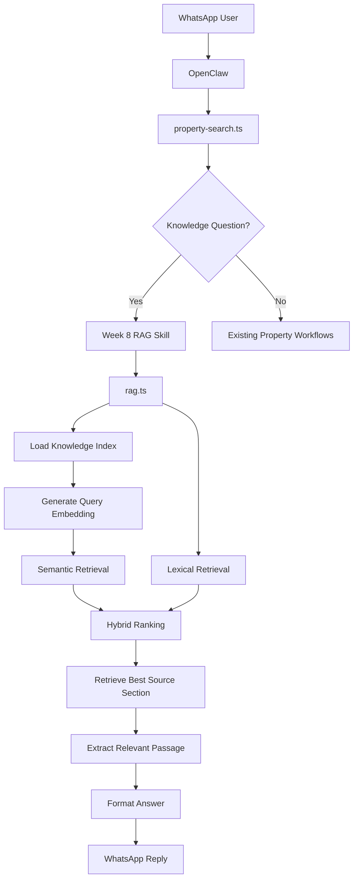
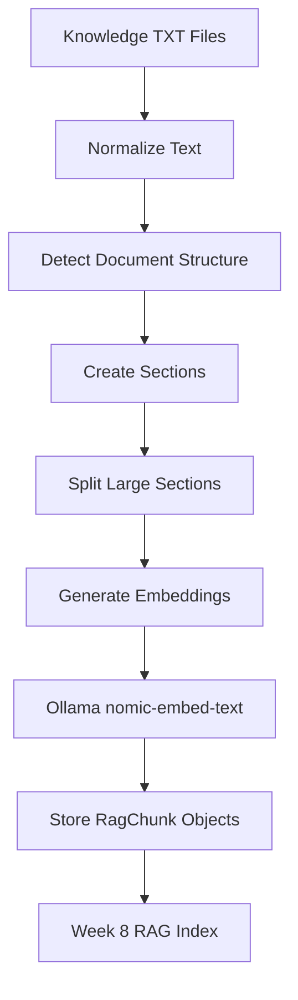
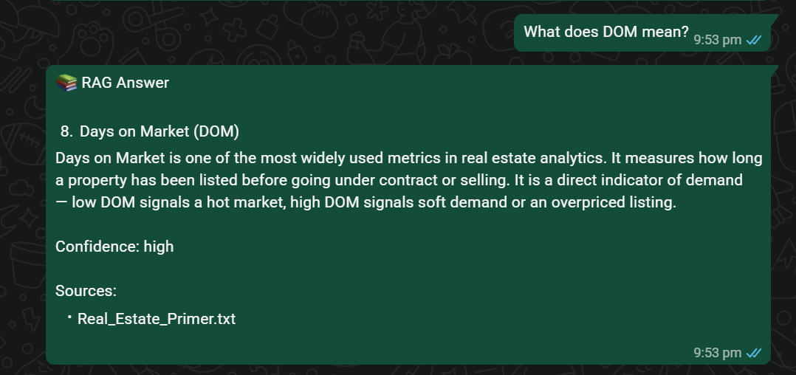
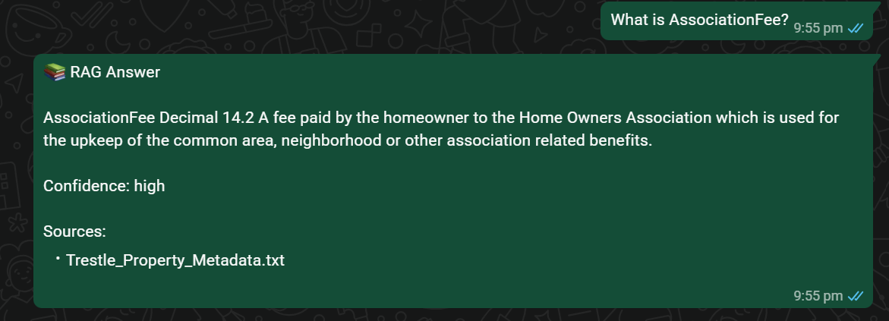
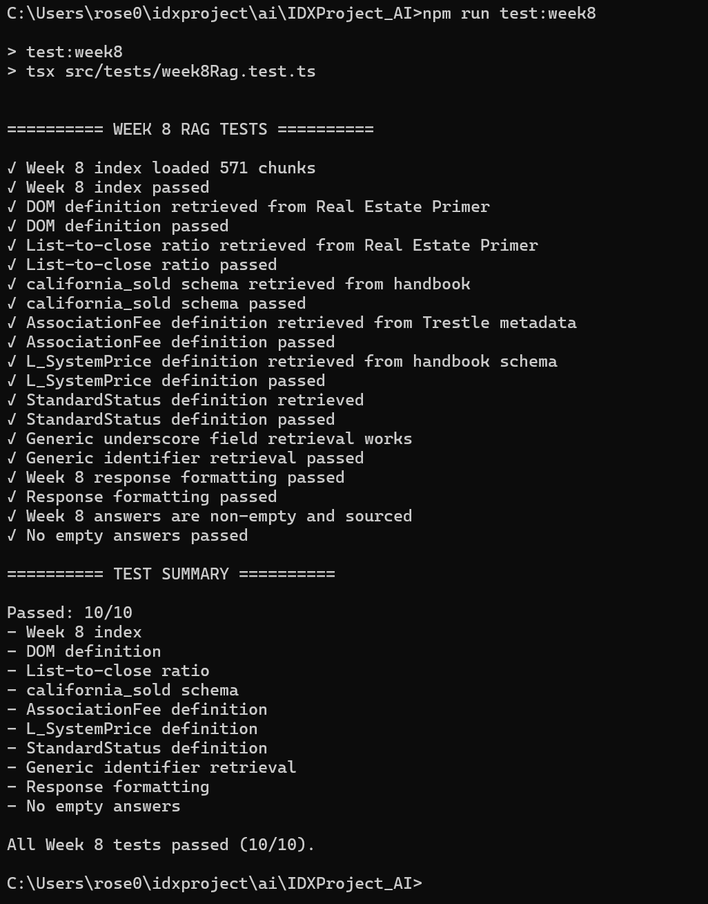

# WEEK 8 - Retrieval-Augmented Generation (RAG)
Week 8 extends the conversational real estate assistant by introducing a **Retrieval-Augmented Generation (RAG) knowledge system**. The purpose of this feature is to allow the assistant to answer real estate terminology, MLS metadata, and database schema questions using indexed project documentation rather than relying only on the language model's general knowledge.

The Week 8 RAG pipeline loads project knowledge sources, divides them into structured sections, generates embeddings using the local **Ollama `nomic-embed-text` model**, and retrieves the most relevant source content using a combination of semantic similarity and lexical matching.

The retrieved source text is then extracted and formatted into a WhatsApp-friendly response that includes the answer, confidence level, and source attribution.

## Project structure
- IDXProject_AI
    - Docs/
      - knowledge/
        - Real_Estate_Primer.txt
        - Trestle_Property_Metadata.txt
        - IDX_Handbook_Schema.txt
    - src/
      - config
      - services/
        - embeddings.ts
        - rag.ts
      - session
      - skills/
        - week8Skill.ts
      - parser
      - types/
        - rag.ts
      - tests/
        - week8Rag.test.ts
    - OpenClaw
      - src/
        - idx/
          - property-search.ts
        - auto-reply/
        - reply/
          - get-reply.ts

## OpenClaw Integration  
The OpenClaw routing pipeline was extended to recognize knowledge and definition questions before they enter the normal conversational property-search workflow.

The following OpenClaw source files were modified:
- **src/idx/property-search.ts**
    - Detecting knowledge questions
    - Detecting schema questions
    - Detecting MLS/RESO field questions
    - Detecting legacy IDX identifiers
    - Separating Week 8 knowledge questions from Week 5 market analytics
    - Routing qualifying questions into the Week 8 RAG skill

- **src/auto-reply/reply/get-reply.ts**
    - Handles WhatsApp recommendation requests.
    - Returns formatted recommendation responses.
    - Preserves conversation context.

> **Note:** These OpenClaw source files have been included in this repository under the **OpenClaw** folder for documentation purposes to demonstrate the integration completed during Week 8.

## Knowledge Sources
The Week 8 RAG system indexes three primary knowledge sources.

### 1. Real Estate Primer
```text
Real_Estate_Primer.txt
```
The Real Estate Primer provides explanations of common real estate concepts and terminology.

Examples include:
- Days on Market (DOM)
- Cumulative Days on Market (CDOM)
- List Price
- Close Price
- Sale-to-List / List-to-Close Ratio
- Property transaction lifecycle
- MLS status codes
- Comparable properties
- Market interpretation concepts
This source is primarily used for real estate terminology and analytical concepts.

### 2. Trestle Property Metadata
```text
Trestle_Property_Metadata.txt
```
The Trestle metadata documentation contains RESO-standard property field definitions.

Examples include:
- AssociationFee
- AssociationFeeFrequency
- AssociationName
- StandardStatus
- PoolPrivateYN
- YearBuilt
- ClosePrice
- ListPrice
- LivingArea
- BedroomsTotal
- PropertyType
- PropertySubType
- ListingKey
- ListingContractDate
- PostalCode
This source allows the assistant to answer questions about MLS and RESO metadata fields.

### 3. IDX Handbook Schema
```text
IDX_Handbook_Schema.txt
```
The handbook schema reference contains documentation for the project's database tables.

The primary tables include:
```text
rets_property
```
and:
```text
california_sold
```
This source is especially important for legacy IDX fields that are not defined directly in the Trestle metadata.

Examples include:
- L_SystemPrice
- L_Keyword2
- LM_Dec_3
- LM_Int2_3
- L_City
- L_Address
- L_Zip
- L_Type_
- L_ListingID
It also documents the columns used in the `california_sold` dataset.

## Files
### 1. `rag.ts`
The `rag.ts` service implements the main Week 8 Retrieval-Augmented Generation pipeline.

Features include:
- Loading knowledge documents
- Normalizing source text
- Removing PDF extraction artifacts
- Detecting document structure
- Building structured knowledge sections
- Splitting large sections into chunks
- Generating the RAG index
- Performing semantic retrieval
- Performing lexical retrieval
- Detecting exact database identifiers
- Extracting relevant source passages
- Formatting knowledge responses
- Returning source attribution and confidence

### 2. `embeddings.ts`
The embedding service generates vector embeddings using Ollama.
The embedding model used is:
```text
nomic-embed-text
```
The service supports:
- Single-text embeddings
- Batch embeddings
- Embedding retries
- Text normalization
- Cosine similarity calculation
Embeddings are generated locally using Ollama.

Example configuration:
```env
OLLAMA_URL=http://localhost:11434
OLLAMA_EMBEDDING_MODEL=nomic-embed-text
```

To prevent the local embedding service from being overloaded when indexing hundreds of chunks, embeddings are generated in batches.

Example:
```text
627 chunks
    ↓
Batch size: 16
    ↓
Approximately 40 embedding requests
```

### 3. `week8Skill.ts`
The Week 8 skill acts as the interface between OpenClaw and the RAG service.

The skill:
1. Receives the user's knowledge question.
2. Calls the Week 8 RAG service.
3. Retrieves the source-grounded answer.
4. Formats the response.
5. Returns the result to WhatsApp.

## RAG Architecture
The Week 8 implementation follows a hybrid retrieval architecture.



## Knowledge Indexing Pipeline
Before questions can be answered, the knowledge documents are converted into searchable vector representations.



## Structured Chunking
Instead of splitting documents into arbitrary fixed-size text blocks, the Week 8 system attempts to preserve the structure of the source documentation.

For example, the Real Estate Primer contains sections such as:
```text
3. List Price vs. Close Price: Why the Difference Matters
7. MLS Status Codes
8. Days on Market (DOM)
```
These section titles are preserved in the indexed chunks.
This improves retrieval because the section title becomes an additional relevance signal.

## Chunk Overlap
Large document sections may exceed the configured chunk size.
When this occurs, the section is divided into multiple chunks while preserving contextual overlap between adjacent chunks.

Example:
```text
Chunk 1
  ↓
Paragraph A
Paragraph B

Chunk 2
  ↓
Paragraph B
Paragraph C
```
The overlapping paragraph prevents important contextual information from being lost at chunk boundaries.

## Embedding Generation
Every knowledge chunk is converted into a numerical vector using:

```text
Ollama
  +
nomic-embed-text
```
Example:
```text
Knowledge Chunk
      ↓
nomic-embed-text
      ↓
Embedding Vector
      ↓
RAG Index
```
The user's question is embedded using the same model.

## Semantic Similarity
Semantic similarity compares the user's query embedding with every knowledge chunk embedding.

Cosine similarity is used:
```text
similarity = (A · B) / (||A|| × ||B||)
```
Higher cosine similarity indicates greater semantic similarity between the user's question and the source passage.

## Lexical Retrieval
Semantic similarity alone is not always sufficient for MLS field names and database identifiers.
For this reason, Week 8 also performs lexical matching.

Examples include:
- L_SystemPrice
- LM_Dec_3
- AssociationFee
- StandardStatus
- california_sold
- rets_property
Exact identifiers receive additional ranking weight.
This allows technical database questions to retrieve the correct schema documentation even when the identifier has limited semantic meaning.

## Hybrid Retrieval
The final retrieval score combines semantic and lexical relevance.

Conceptually:
```text
Final Retrieval Score = 
Semantic Similarity
        +
Lexical Relevance
        +
Section Relevance
        +
Identifier Relevance
```
The implementation uses weighted scoring so that both natural-language concepts and exact technical identifiers can be retrieved reliably.

## Exact Identifier Retrieval
Technical field questions require additional precision.

For example:
```text
What does L_SystemPrice mean?
```

The system detects:
```text
L_SystemPrice
```
as an explicit identifier.

It then searches the indexed schema documentation for the exact field and extracts the corresponding source row.
The field definitions are not hard-coded into the application.
They are extracted from the indexed documentation.

## Acronyms vs. Field Identifiers
The identifier detector distinguishes technical field names from ordinary acronyms.

For example:
```text
AssociationFee
StandardStatus
L_SystemPrice
```
are treated as field identifiers.

However:
```text
DOM
CDOM
MLS
HOA
```
are treated as terminology rather than database identifiers.

This allows questions such as:
```text
What does DOM mean?
```
to use semantic section retrieval instead of incorrectly treating `DOM` as a database field.

## Section-Aware Retrieval
Long knowledge sections may span multiple chunks.
When a relevant section is identified, the system can preserve the section context so that the answer is extracted from the appropriate portion of the source.

Example:
```text
8. Days on Market (DOM)
```

contains:
```text
Definition
    ↓
Calculation
    ↓
CDOM explanation
    ↓
Interpretation
```

For a definition question, the system prioritizes the introductory explanation rather than returning an unrelated later subsection.

## Example Supported Questions
- What does DOM mean?
- What is a list-to-close ratio?
- What does ClosePrice mean?
- What is AssociationFee?
- What does L_SystemPrice mean?
- What columns are in california_sold?
- What does PoolPrivateYN mean?
- Explain LM_Dec_3
- What fields are in rets_property?

## Features Implemented
Week 8 features include:
- Retrieval-Augmented Generation
- Local Ollama embeddings
- `nomic-embed-text`
- Structured document indexing
- Section-aware chunking
- Chunk overlap
- Semantic similarity search
- Cosine similarity
- Lexical retrieval
- Hybrid retrieval ranking
- Exact identifier retrieval
- Legacy IDX field support
- RESO metadata retrieval
- Database schema retrieval
- Source attribution
- Confidence levels
- PDF artifact cleanup
- WhatsApp response formatting
- OpenClaw routing integration
- Automated RAG testing

## Test Cases
The Week 8 RAG pipeline is validated using `week8Rag.test.ts`

### 1. RAG Index Test
**Verified**
- Knowledge documents load successfully
- Structured chunks are generated
- Embeddings are generated
- All required sources are indexed

Expected sources:
```text
Real_Estate_Primer.txt
Trestle_Property_Metadata.txt
IDX_Handbook_Schema.txt
```

### 2. DOM Definition
**Query**
```text
What does DOM mean?
```

**Verified**
- Real Estate Primer retrieved
- Days on Market section retrieved
- Definition extracted
- Source attribution returned

### 3. List-to-Close Ratio
**Query**
```text
What is a list-to-close ratio?
```

**Verified**
- Real Estate Primer retrieved
- ListPrice retrieved
- ClosePrice retrieved
- Sale-to-list explanation retrieved

### 4. california_sold Schema
**Query**
```text
What columns are in california_sold?
```

**Verified**
- Handbook schema retrieved
- `california_sold` section identified
- ListingKey retrieved
- ClosePrice retrieved
- CloseDate retrieved
- ListPrice retrieved

### 5. AssociationFee
**Query**
```text
What does AssociationFee mean?
```

**Verified**
- Trestle metadata retrieved
- Exact metadata field identified
- Field definition extracted

### 6. L_SystemPrice
**Query**
```text
What does L_SystemPrice mean?
```

**Verified**
- Handbook schema retrieved
- Legacy IDX field identified
- Field definition extracted

### 7. StandardStatus
**Query**
```text
What is StandardStatus?
```

**Verified**
- StandardStatus located in indexed documentation
- Exact identifier retrieval works
- Source attribution returned

### 8. Generic Identifier Retrieval
**Query**
```text
Explain LM_Dec_3
```

**Verified**
- Underscore identifier detected
- Indexed schema searched
- Matching field retrieved
- No field-specific hard-coded answer required

### 9. Response Formatting
**Verified**
The formatted response contains:

```text
📚 RAG Answer
Confidence:
Sources:
```

### 10. Source Validation
**Verified**

- Answers are non-empty
- Answers contain source attribution
- Knowledge responses are grounded in indexed documentation

### Test Summary
The Week 8 automated test suite validates:
- RAG index creation
- DOM definition retrieval
- List-to-close ratio retrieval
- `california_sold` schema retrieval
- AssociationFee metadata retrieval
- L_SystemPrice legacy field retrieval
- StandardStatus retrieval
- Generic identifier retrieval
- Response formatting
- Source attribution

**Result:** All Week 8 RAG tests passed successfully.


## Run Tests
### Run Week 8 RAG Test
```bash
npm run test:week8
```

## Deliverables
### Example 1 - DOM


### Example 2 - List-to-Close Ratio


### Example 3 - california_sold Schema


### Example 4 - MLS Field Definition


### Week 8 Test



