# WEEK 9 - Multi-Agent Orchestration
Week 9 integrates the specialized AI capabilities developed in the previous weeks into a single multi-agent orchestration system. Instead of manually routing each incoming request directly to a specific Week 4, Week 5, Week 7, or Week 8 skill, a centralized orchestrator now analyzes the user's request, determines the required intent or intents, and routes the request to the appropriate specialized agents.

The orchestration layer supports both single-intent and mixed-intent requests. A single query can therefore trigger property search, market analytics, recommendation, RAG knowledge retrieval, or email drafting. Mixed requests can invoke multiple agents while preserving the existing conversational property-search behavior from Week 4.

## Project structure
- IDXProject_AI
    - Docs
    - src/
      - agents/
        - agents.ts
        - types.ts
      - config
      - services/
        - intentClassifier.ts
        - orchestrator.ts
      - session
      - skills/
        - week9Skill.ts
      - parser
      - types/
        - rag.ts
      - tests/
        - week9Orchestrator.test.ts
    - OpenClaw
      - src/
        - idx/
          - property-search.ts
        - auto-reply/
        - reply/
          - get-reply.ts

## OpenClaw Integration  
The OpenClaw property routing layer was simplified so that incoming real-estate requests can be passed into the Week 9 orchestration system.

The overall OpenClaw flow is:
```text
WhatsApp
    ↓
OpenClaw
    ↓
property-search.ts
    ↓
week9Skill.ts
    ↓
orchestrator.ts
    ↓
intentClassifier.ts
    ↓
Specialized Agent
```

The orchestration layer replaces the previous approach where `property-search.ts` manually determined whether a request should be sent to Week 4, Week 5, Week 7, or Week 8.
This centralizes routing decisions inside the Week 9 architecture.

> **Note:** OpenClaw integration files are included in the repository under the OpenClaw folder for documentation purposes.

## Files
### 1. `intentClassifier.ts`
Responsible for determining the user's intent.

Features include:
- Property-search detection
- Semantic property-query detection
- Market-query detection
- Recommendation-query detection
- RAG/knowledge-query detection
- Email-query detection
- Mixed-intent detection
- Definition-question prioritization
- Email-request prioritization
- Active property-conversation awareness
- Active market-conversation awareness

### 2. `orchestrator.ts`
Acts as the central Week 9 coordinator.

Responsibilities include:
- Calling the intent classifier
- Selecting the appropriate agent
- Running property search first for conversational mixed requests
- Saving pending intents
- Restoring pending intents
- Sharing property context with the market agent
- Executing pending agents
- Combining multiple agent responses
- Clearing completed pending state

### 3. `agents.ts`
Defines the Week 9 specialized agent registry.

Registered agents:
- propertySearchAgent
- marketStatsAgent
- recommendationAgent
- ragAgent
- emailDraftAgent

Each agent delegates to the functionality implemented during previous internship weeks.

### 4. `week9Skill.ts`
Provides the Week 9 skill entry point.

The skill calls:
```text
orchestrate(message, userId)
```

and returns the final orchestration result.
It also provides centralized error handling for orchestration failures.

### 5. `sessionManager.ts`
Stores user conversation state.

Week 9 uses the existing session manager for:
- Property conversation state
- Market conversation state
- Previous property results
- Pending intents
- Pending query context

This prevents the orchestrator from requiring a separate state-management system.

## Intent Classification
A centralized intent classifier was implemented in `intentClassifier.ts`
The classifier determines which specialized agent should process each request.

### Supported Intents
- property search
- market analysis 
- Recommendation
- knowledge (RAG)
- email
- mixed
- unknown

## Agents
The Week 9 implementation contains the following specialized agents:

### 1. `propertySearchAgent`
Handles property-search requests.
The agent delegates property conversations to the existing Week 4 conversational property search workflow.

Features preserved from previous weeks include:
- Natural language property parsing
- Structured property filters
- Multi-turn conversations
- Missing-field follow-up questions
- Session memory
- Semantic property preferences
- SQL property search
- Semantic reranking
- Sold comp display

Example:
- Find 3 bedroom condos in Irvine under $1.5M
- Show me homes with a pool
- Luxury condo near the beach
- Quiet single family home in Pasadena

Routing:
```text
propertySearchAgent
        ↓
handleWeek4Conversation()
        ↓
rets_property
```

### 2. `marketStatsAgent`
Handles market analytics and housing-market questions using the Week 5 market analytics engine.

Supported analytics include:
- Median close price
- Average close price
- Average price per square foot
- Average days on market
- List-to-close ratio
- Active inventory
- Sold transaction volume
- Monthly price trends
- Month-over-month changes
- Year-over-year changes

Example:
- What are the market trends in Pasadena?
- Are prices rising in Irvine?
- What is the average price per square foot?
- What is the median home price in Pasadena?

Routing:
```text
marketStatsAgent
        ↓
week5Skill()
        ↓
california_sold
        +
rets_property
```

### 3. `recommendationAgent`
Handles property recommendation requests using the Week 7 hybrid recommendation engine.

The recommendation system combines:
- Structured property similarity
- Semantic embedding similarity
- Listing attributes
- Property location
- Property price
- Bedrooms
- Square footage
- Property type
- Sold comp validation

Example:
- Show me similar homes to this
- Recommend comparable properties
- Find something similar
- What other homes are like this?

The recommendation agent can use the previous property-search results stored in session memory as the target listing.

Routing:
```text
recommendationAgent
        ↓
week7Skill()
        ↓
recommendSimilarListings()
        ↓
rets_property
        +
california_sold
```

### 4. `ragAgent`
Handles real-estate knowledge, terminology, MLS schema, and field-definition questions using the Week 8 RAG pipeline.

Example:
- What does DOM mean?
- What is a list-to-close ratio?
- What does AssociationFee mean?
- What columns are in california_sold?

Routing:
```text
ragAgent
        ↓
week8Skill()
        ↓
RAG Retrieval
        ↓
Indexed Knowledge Documents
```

### 5. `emailDraftAgent`
Handles email drafting requests.
During Week 9, the email agent creates draft-only responses.
No email is automatically sent.

Example:
- Draft an email with the Pasadena market report
- Prepare an email summary
- Email me a property summary

The full email approval and sending workflow will be implemented later in the  project.

## Mixed-Intent Classification
The orchestrator can detect multiple intents inside a single user request.

Example:
- Find affordable homes in Pasadena and tell me whether prices are rising
- Quiet single family home in a tree-lined neighborhood and tell me whether prices are rising

Detected intents:
- property search
- market

Example 2:
- Are prices rising in Irvine and what does AssociationFee mean?

Detected intents:
- market
- rag


The orchestrator coordinates both agents instead of forcing the user to submit two separate requests.

The property agent runs first. The assistant continues collecting the missing information through normal conversational workflow
During this conversation, the market intent remains pending.
Once the property search is complete, the orchestrator executes the pending market agent.

## Pending Mixed-Intent Workflow
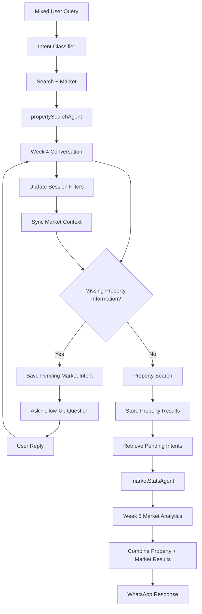

## Overall Workflow
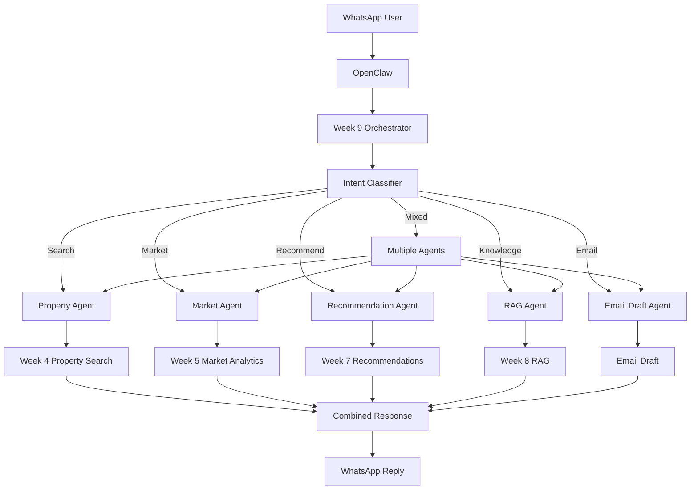

## Features Implemented
Week 9 features include:
- Multi-agent orchestration
- Centralized intent classification
- Property-search routing
- Market-analytics routing
- Recommendation routing
- RAG knowledge routing
- Email-draft routing
- Mixed-intent detection
- Deferred mixed-intent execution
- Pending-intent session memory
- Cross-agent context sharing
- Conversational property search preservation
- Multi-turn mixed requests
- Unified multi-agent responses
- OpenClaw integration
- WhatsApp integration
- Automated orchestration tests

## Test Cases
The Week 9 multi-agent orchestration implementation was validated using `week9Orchestrator.test.ts`

### 1. Intent Classification
The classifier was tested using requests for:
- Property search
- Market analytics
- Recommendations
- RAG knowledge
- Email drafting
- Mixed intent

Example:
- Find affordable homes in Pasadena and tell me whether prices are rising

Expected:
- intent = mixed
- detectedIntents = search , market

**Verified:**
- Correct search classification
- Correct market classification
- Correct recommendation classification
- Correct knowledge classification
- Correct email classification
- Correct mixed-intent classification

### 2. Property Search Orchestration
**Query**
```text
Find 3 bedroom homes in Irvine under $1.5M
```

**Verified:**
- Intent classified as `search`
- `propertySearchAgent` selected
- Week 4 property conversation invoked
- Property response returned successfully

### 3. Market Analytics Orchestration
**Query**
```text
Tell me about the Pasadena market
```

**Verified:**
- Intent classified as `market`
- `marketStatsAgent` selected
- Week 5 market analytics invoked
- Market response returned successfully

### 4. RAG Orchestration
**Query**
```text
What does DOM mean?
```

**Verified:**
- Definition question classified as `knowledge`
- `ragAgent` selected
- Week 8 RAG pipeline invoked
- Grounded response returned successfully

### 5. Recommendation Orchestration
The recommendation test first performs a property search to populate the user's `lastResults`.

The test then submits:
```text
Show me similar homes to this
```

**Verified:**
- Intent classified as `recommend`
- `recommendationAgent` selected
- Previous property result used as recommendation target
- Week 7 recommendation engine invoked
- Recommendation results returned successfully

### 6. Email Draft Orchestration
**Query**
```text
Draft an email with the Pasadena market report
```

**Verified:**
- Intent classified as `email`
- `emailDraftAgent` selected
- Draft response created
- Draft status set to `pending_approval`
- No email automatically sent

### 7. Mixed-Intent Pending Conversation
**Query**
```text
Find affordable homes in Pasadena and tell me whether prices are rising
```

**Verified:**
- Query classified as `mixed`
- Search and market intents detected
- Property agent executed first
- Week 4 follow-up question returned
- Market intent stored as pending
- Original query stored for later execution

### 8. Mixed-Intent Conversational Follow-Up
The test verifies that the pending market intent survives multiple Week 4 conversational messages.

Example:
```text
Assistant: What is your maximum budget?
User: any
```

**Verified:**
- Follow-up routed back to property search
- Week 4 conversation continued
- Pending market intent remained stored
- Pending request was not lost

### 9. Mixed-Intent Completion and Market Execution
**Original Query**
```text
Quiet single family home in a tree-lined neighborhood
and tell me whether prices are rising
```

Conversation:
```text
Assistant: Which city are you interested in?
User: Pasadena

Assistant: What is your maximum budget?
User: any

Assistant: How many bedrooms do you need?
User: any

Assistant: How many bathrooms do you need?
User: any
```

After the property conversation completes, the pending market agent receives:
```text
city = Pasadena
propertyType = SingleFamilyResidence
months = 24
```

**Verified:**
- Property search completed
- `propertySearchAgent` returned listings
- Pending `marketStatsAgent` executed
- Pasadena was passed to the market agent
- Property type was shared with the market agent
- Market period was preserved
- Combined property + market response returned
- Pending intent state cleared after completion

## Test Summary
The Week 9 automated test suite validates:
- Intent classification
- Single-agent routing
- Property-search orchestration
- Market-analytics orchestration
- Recommendation orchestration
- RAG orchestration
- Email-draft orchestration
- Mixed-intent detection
- Pending-intent persistence
- Multi-turn mixed conversations
- Cross-agent context sharing
- Deferred market-agent execution
- Combined multi-agent responses
- Session cleanup after orchestration

**Result:** All Week 9 multi-agent orchestration tests passed successfully.

## Run Tests
### Run Week 9 Orchestrator Test
```bash
npm run test:week9
```

## Challenges Encountered
### Intent Overlap
Several real-estate terms can belong to more than one agent.

For example `DOM` can represent a market metric, while:

```text
What does DOM mean?
```
is a knowledge-definition question.
The classifier initially identified both `market` and `knowledge`, causing the request to be classified as mixed.

This was resolved by introducing intent-priority rules so definition questions are routed to the RAG agent while analytical DOM questions continue to route to the market agent.

### Email and Market Intent Overlap
Requests such as:
```text
Draft an email with the Pasadena market report
```
contain both email and market-related language.
The classifier initially detected both intents.

Email-specific priority rules were introduced so explicit email drafting requests route to the email agent.

### Preserving Mixed Intent During Conversation
A mixed request may require multiple Week 4 follow-up questions before the property search can execute.
Without additional session state, the secondary market intent would be lost after the first user response.

This was resolved using:
```text
pendingIntents
pendingQuery
```
which preserve the unfinished parts of the original request throughout the conversation.

### Sharing Context Between Agents
The original mixed request may not contain all the information required by another agent.

For example:
```text
Quiet single family home in a tree-lined neighborhood
and tell me whether prices are rising
```
does not specify a city.
The city may only be provided later through conversational workflow

The orchestrator was updated to synchronize property conversation state with the existing market session fields so the pending market agent receives the final city, property type, and time period.


## Deliverables
### Example 1 - Property Search Agent
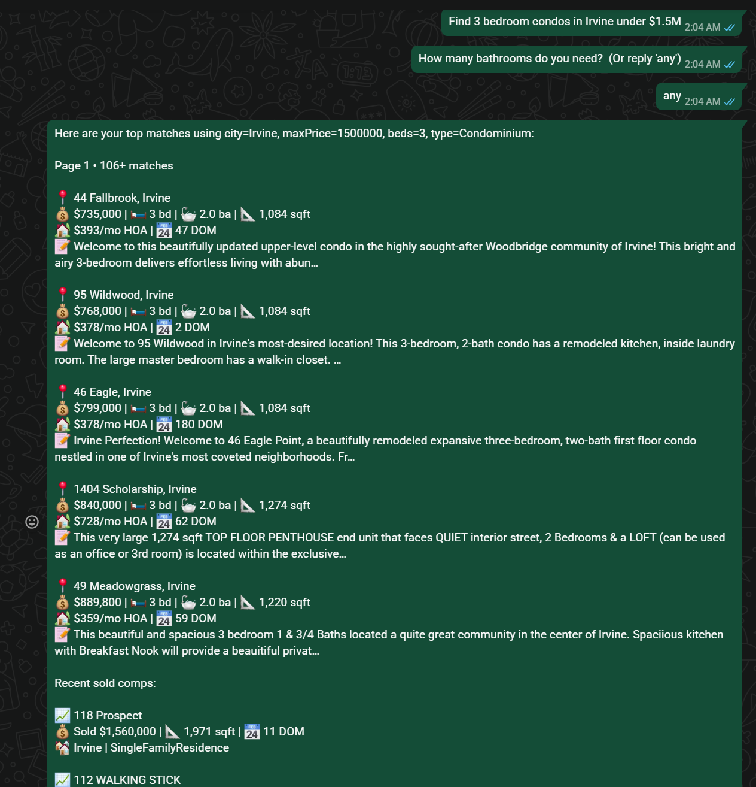

### Example 2 - Recommendation Agent
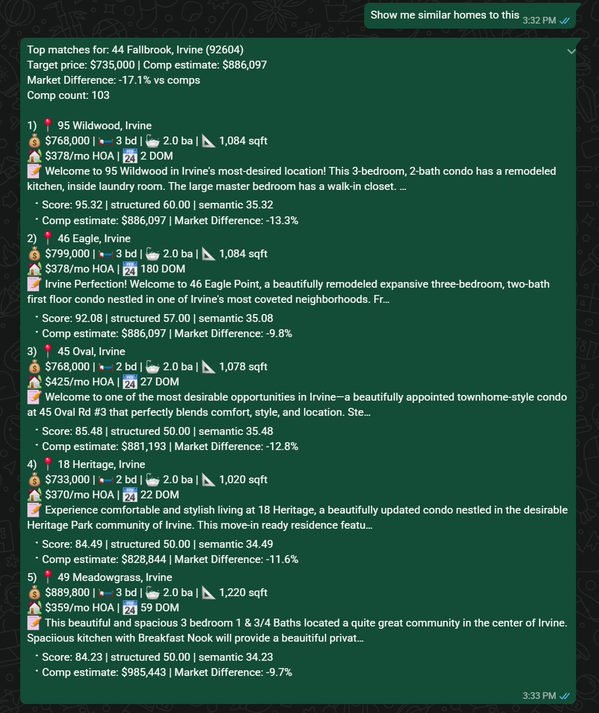

### Example 3 - Market Statistics Agent
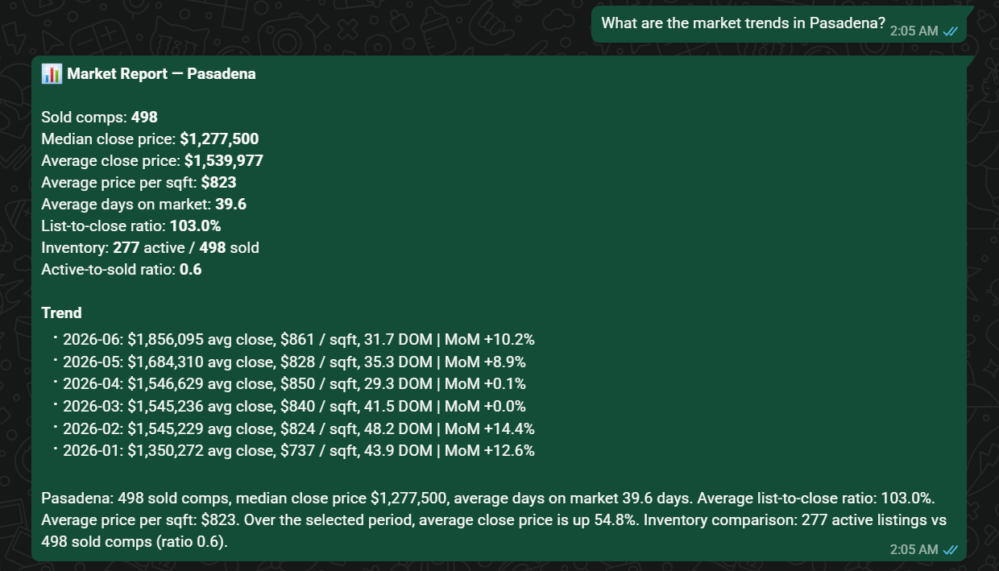

### Example 4 - RAG Agent
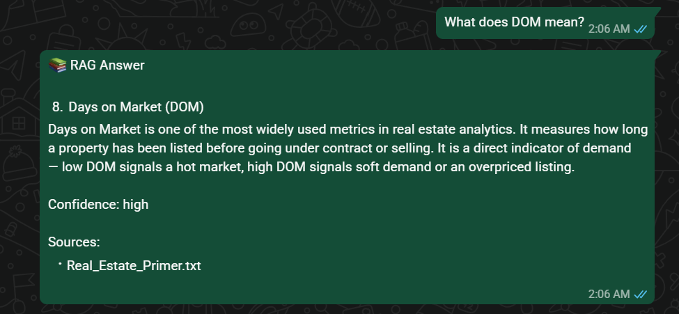

### Example 5 - Mixed-Intent Conversation 1
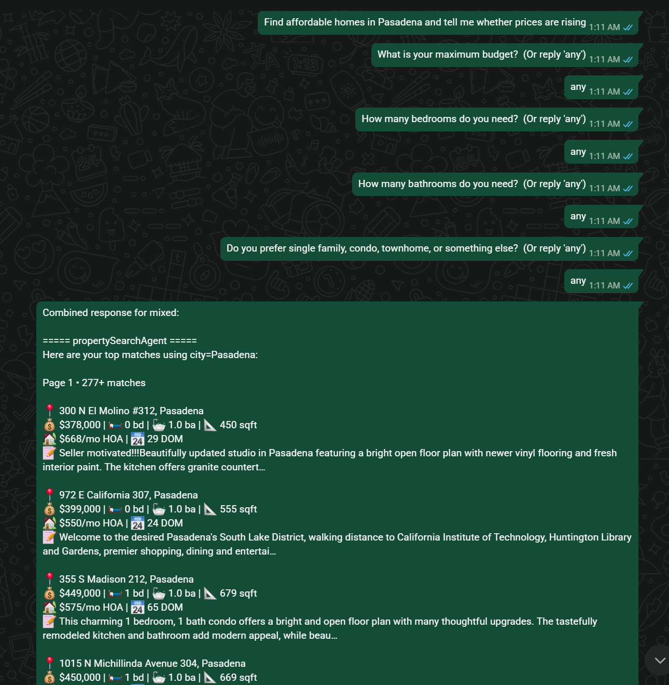
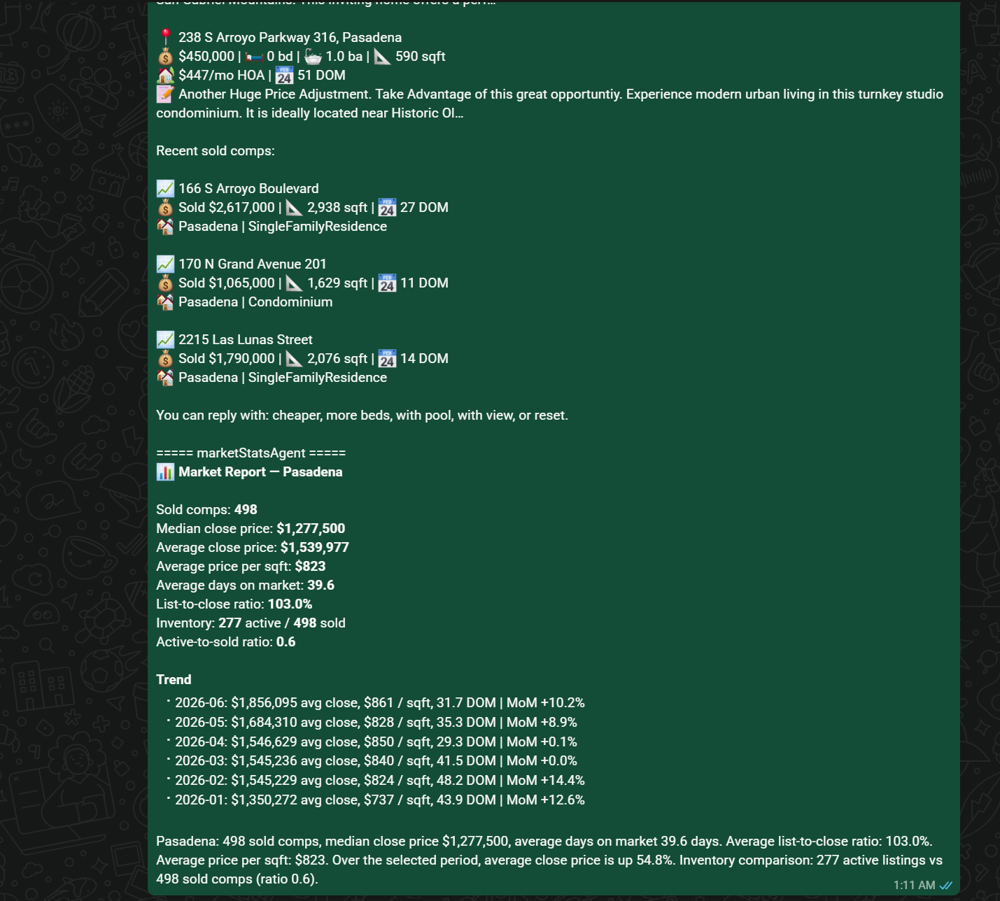

### Example 6 - Mixed-Intent Conversation 2
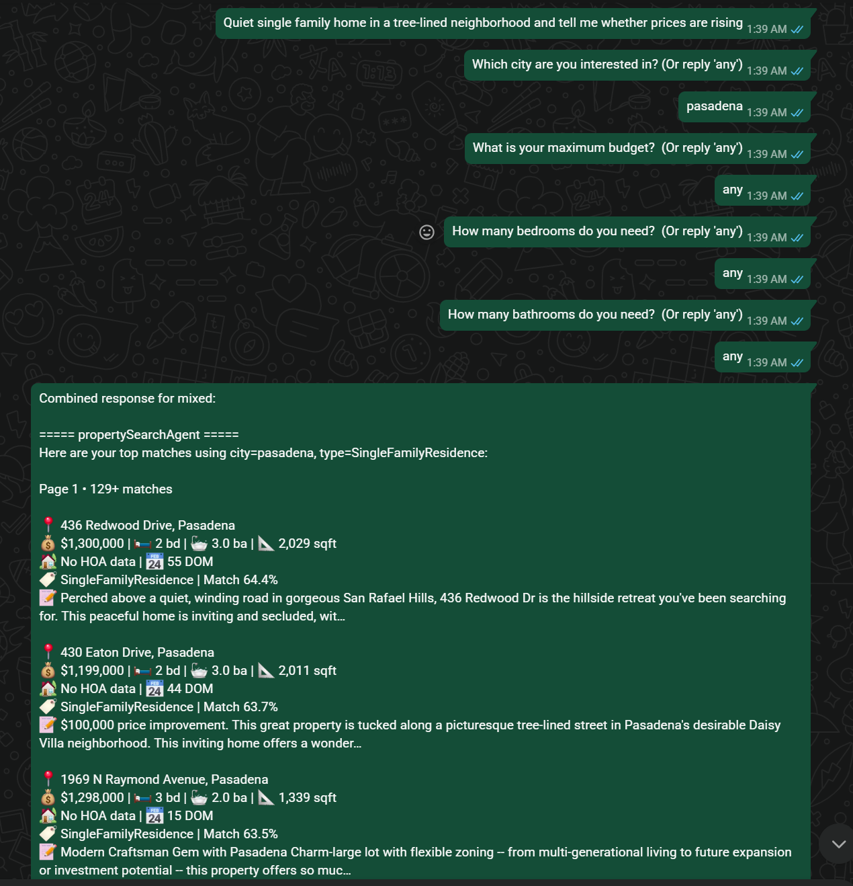
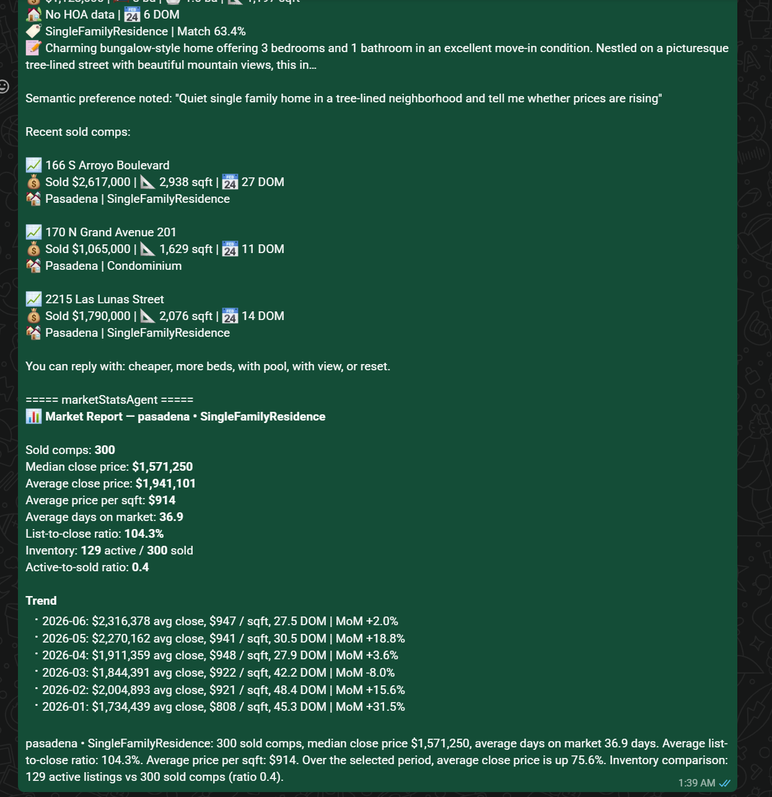

### Example 7 - Mixed-Intent Conversation 3
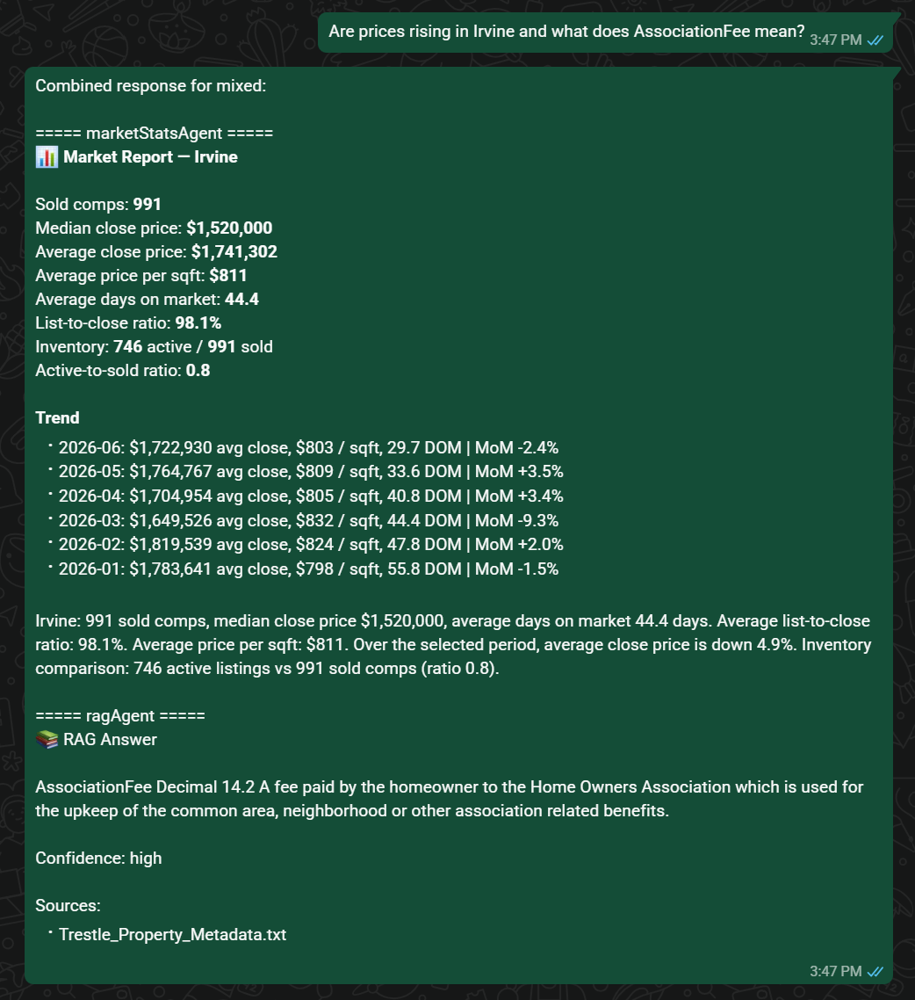

### Example 8 - E-Mail Agent
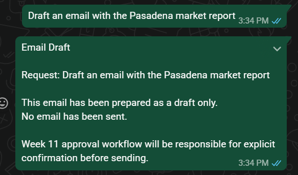

### Week 9 Test
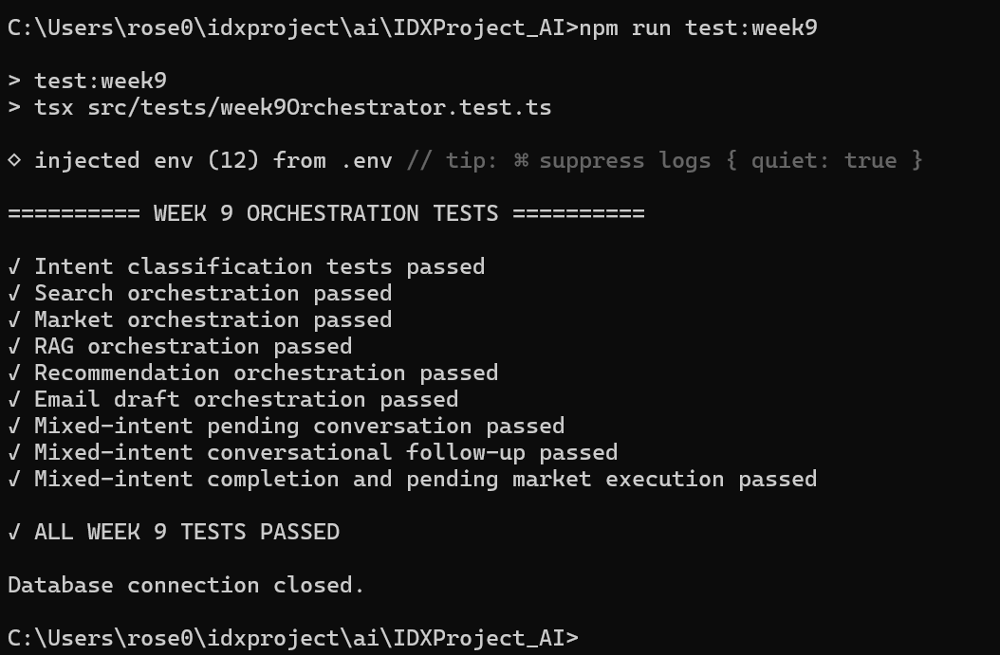


